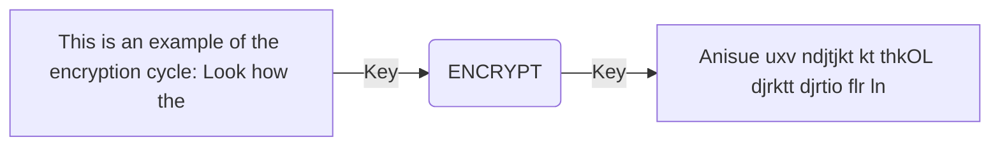

## Page 1

# NOTIS - ENCRYPT

**ND 211004  NOTIS-ENCRYPT for ND-100**



```
    ND
Norsk Data
```

_Scanned by Jonny Oddene for Sintran Data © 2010_

---

## Page 2

# NOTIS-ENCRYPT for ND-100

## INTRODUCTION

NOTIS-ENCRYPT is a tool for the security-conscious. It will encrypt all types of files based on individual encryption keys. This will enhance security and prevent persons with access to the area from accessing specific files or DS-documents. A necessary program for personnel management and administration.

The program is very small, easy to operate, and quick in execution.

## FEATURES

- Encrypts all file types, including NOTIS-DS documents and program files.
- Each user defines individual encryption keys. No limitation on the number of encryption keys per user.
- The file (or files) cannot be accessed without specifying the encryption key for that specific file.
- The encryption key is not stored on the system.

## PRODUCT DESCRIPTION

This product was developed to enhance the security of the SINTRAN operating system. It is user-activated, and the encryption is individual for each user. All types of files and DS-documents can be encrypted using NOTIS-ENCRYPT, and they can only be de-crypted by specifying the correct encryption key.

## Using NOTIS-ENCRYPT

The user calls the program from any terminal. A short explanation of the encryption key system is then displayed on the screen. The user is queried on the file name that is to be encrypted and what key the system should use for this encryption. The key will not be stored anywhere on the system, and the user must remember the key to be able to access the file later. The file is then encrypted and stored on the disk. To edit this file, the user must run the program and specify the encryption key before the file can be displayed.

## REQUIREMENTS

- NOTIS-ENCRYPTION requires SINTRAN-III, version J or later.
- NOTIS-ENCRYPTION consists of one program (31 pages).
- The program is not currently available on the ND-500 series.

## DOCUMENTATION

NOTIS-ENCRYPT Description card..........ND 99.004 EN

## Corporate Information

```plaintext
ND Norsk Data

CORPORATE HEADQUARTERS
Prof. Holvies vei 1
P.O. Box 25, Bogerud
0619 Oslo 6
Norway

Tel.: +47-2-625000
Swic: +475300
Telex: 479741 nd n
Telephone: 02-87 29 40

NORWAY
Bergen, tel. +47-2-390520
Oslo, tel. +47-2-569150
Sandnes, tel. +47-4-624260
Trondhem, tel. +47-7-591750 / 7-921222
Tromse, tel. +47-83-17676
```

```plaintext
SWEDEN
ND Norsk Data AB
Kanalvagen 3
P.O. Box 721
191 20 Upplands Vasby
Sweden

Tel.: +46-8-200-930
Telex: 15696-nordata s
Telephone: 46-8-8602781 (A)
```

```plaintext
WEST GERMANY
Thomasstrasse 10-12
638 Bad Homburg v.d.H.
West Germany

Tel. 06181 / 7553/dd
Telex: 42152-2729 (A)
```

```plaintext
UNITED KINGDOM
Norsk Data Ltd. Harway House
332 Kennington Rd.
London SW9 1QR
United Kingdom

Tel.: +441-836-5800
```

```plaintext
USA
Norsk Data N.A., Inc.
56, William Street
Wellesley
Massachusetts 02181
USA

Tel.: 1 617 237 7966
```

---

