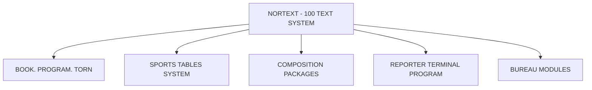

## Page 1

# NORTEXT FORMS COMPOSITION PACKAGE

**ND-211022**



```
ND
COMTEC
DIVISION OF NORSK DATA
```

---

## Page 2

# NORTEXT Forms Composition Package

## Product Summary

The purpose of the NORTEXT Forms Composition Package is to provide a flexible, user-friendly tool for producing forms, by using a few format commands with coordinates to place boxes, vertical and horizontal rules, and text. One uses the NET-terminal with the Graphic Option Module for checking the composition of the forms.

The NORTEXT Forms Composition Package is based upon the use of a layout-sheet prepared for a 10 pitch typewriter/printer.

In some cases, we must be able to specify the coordinates of text/rules/boxes more precisely than the scale of the layout-sheet allows. To achieve this, we must multiply all vertical references by 10 before using them in the formats.

## Work Procedure

Before starting to use the program, the following files must be installed:

- FCP-FORMAT-Ax:TEXT (Textjob with the format definitions)
- FCP-FTEST-Ax:TEXT (Test job with a layout sheet)

Fine adjustment of the formats may be done by modifying the constants in the format INIT:

- `a30`: The constant for the vertical movements
- `a31`: The constant for the horizontal movements
- `a32`: The constant for the thickness of the rules

All calculations are done in internal units. The constants depend on what units the phototypesetter works with (didot or pica). In addition, individual variations may be required for each typesetter.

The above mentioned constants may be changed to handle other scales (1/10 mm. or in typographical points). The parameters for horizontal or vertical movements and the thickness of the rules are always multiplied by those constants.

When the result of the test-job (layout-sheet) is satisfying, the local formats must be stored as global formats.

The text job is started with a global format call. Then use the various local formats calls designed for:

- boxes
- horizontal rules
- vertical rules
- vertical rules, with horizontal positioning except thickness of rule
- text
- move part of the form up/down from this point

In addition one can use function codes for fonts and pointsize. The leading is always set to 0 which means that each line is to be ended with a line ending code. A new format call with parameters must be given for each new line.

---

## Page 3

# NORTEXT Forms Composition Package

## Parameters in Use

- **a**: y-coordinate from left, column no.
- **b**: x-coordinate from top, line no
- **lh**: Horizontal length: column number to end in
- **lv**: Vertical length, line number to end in
- **t**: Thickness of rules/frames given in 1/10 of a point
- **x**: x/-x vertical units

## Requirements

- **ND-210800** NORTEXT Editor for ND-110
- **ND-103220** NORTEXT Editing terminal - NET (green-green); or:
- **ND-110003** NORTEXT Editing terminal - NET (black-white)
- **ND-103270** Graphic Option module

The users of the NORTEXT Forms Composition Package must be familiar with both local and global formats in NORTEXT Text System and with the Function Code Arithmetics.

## Documentation

| Description                   | Document Number   |
|-------------------------------|-------------------|
| NORTEXT Forms Composition     |                   |
| Package                       | ND 61.047.1 EN    |
| NORTEXT Editor                | ND 61.035.1 EN    |
| NORTEXT Typographic           |                   |
| Functions Codes               | ND 61.029.1 EN    |

_NOTE: ND COMTEC reserves the right to change specifications without notice._

---

