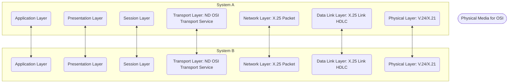
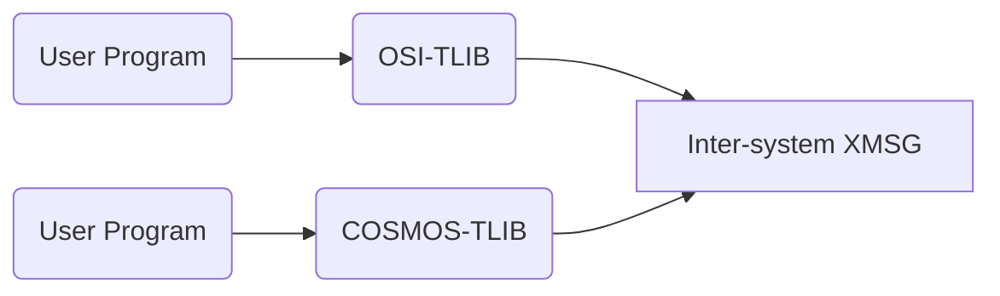
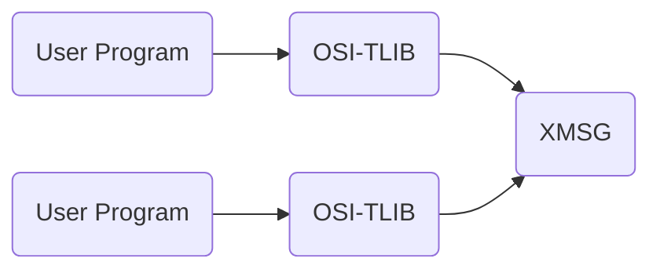
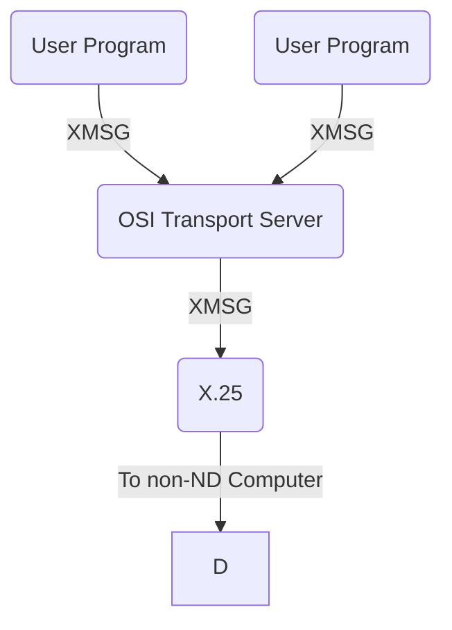

## Page 1

# ND OSI Transport Service

ND 211023

## The Reference Model for Open Systems Interconnection

---

[Logo: Norsk Data]

*Scanned by Jonny Oddene for Sintran Data © 2010*

---

## Page 2

# ND OSI Transport Service

## Introduction

The ND OSI Transport Service enables programs running on ND computers to communicate with programs running on computers sold by other vendors, and with programs running on other ND computers. The product is a set of software tools designed to achieve this communication. It completely conforms to the transport layer of the seven-layer Open Systems Interconnection (OSI) protocols, defined by the International Standards Organisation (ISO 8072).

The ND OSI Transport Service provides the Transport Layer of the OSI seven-layer model. This product has two parts: The OSI Transport Library (OSI-TLIB), and the OSI Transport Server (OSITS).

The OSI Transport Service runs on the full range of ND systems, from the Satellite models up to the ND-500 model range.

## Features

The ND OSI Transport Service has the following features:

- Provides for communications with non-ND systems across an X.25 packet-switched Wide Area Network (WAN).
- Allows user programs to communicate over COSMOS (ND's proprietary networking system) with other ND computers.
- Allows communication from one process to one or several other processes over a variety of networks. This communication is transparent to the user.
- Provides user interfaces to programs written in PLANC, as well as in other high-level languages like FORTRAN, PASCAL, and COBOL.
- Conforms to Class 0 and Class 2 of the OSI Transport Protocol.
- The OSI transport library and the COSMOS transport library are compatible.
- The System Supervisor controls the action of the OSITS by using the XMSG (ND's proprietary message-switching system) command program. This command program has functions to define routes to remote systems, and to start/stop OSITS.
- One program can have several logical connections over one network connection.
- Several programs may share a single network connection.

## Description

The ND OSI Transport Service comprises the OSI Transport Library (OSI-TLIB) and the OSI Transport Server (OSITS).

The OSI-TLIB is a set of subroutines that can be called by a user program to set up transport connections and to pass data between the connected programs. It uses (XMSG) to carry the OSI Transport Protocol messages. Thus, it is used in a similar way as the COSMOS Transport Library (TLIB) for communication between programs in ND computers. Within one machine, the data will be passed using single system XMSG.

Two sets of routines are provided in the OSI-TLIB part of the ND OSI Transport Service. One of these sets is used by programs written in PLANC (ND’s internal systems programming language). The other set is used by programs written in FORTRAN, PASCAL, or COBOL. Both sets of user routines provide a user interface that complies with the requirements of the OSI Transport Service Definition (ISO 8072).

To ease the transition from COSMOS-TLIB to OSI-TLIB, the user program interfaces of the two libraries are compatible. This enables user programs that call COSMOS-TLIB routines to call OSI-TLIB routines instead, simply by recompiling and relinking. A user program calling OSI-TLIB can also connect to, and exchange data with, a program calling COSMOS-TLIB.

The OSI Transport Server (OSITS) is a real-time program used to convert the XMSG protocol messages, produced by OSI-TLIB, into OSI Transport Protocol passed over X.25 to a remote computer. The protocol conforms to the OSI Transport Protocol Specification (ISO 8073). OSITS must be used in conjunction with OSI-TLIB when communicating with a non-ND system that supports the OSI Transport Protocol. The use of OSITS is transparent to the user programs.

---

## Page 3

# ND OSI Transport Service

## Requirements

- ND Systems running SINTRAN Version J or later.
- XMSG Version J or later.
- COSMOS X.25 Option Version B or later.

## Documentation

### Manuals

| Document                                   | Code        |
|--------------------------------------------|-------------|
| OSI Transport Service Programmer Guide     | ND-60.237 EN|
| OSI Transport Service Operator Guide       | ND-30.050 EN|

### Relevant Manuals

| Document                                   | Code        |
|--------------------------------------------|-------------|
| COSMOS Operator Guide                      | ND-30.025 EN|
| COSMOS X.25 Option Operator’s Guide        | ND-30.034 EN|

### OSI Reference Documents

- OSI Transport Protocol Specification (ISO 8073)
- OSI Transport Service Definition (ISO 8072)

*Single ND System Communicating with a non-ND System*

The OSITS supports class 0 and Class 2 of the OSI Transport Protocol. Class 0 supports basic functions and can be used when a reliable network can be assumed. Class 2 service allows multiplexing of several transport connections, from the same or from different user programs, over one network connection. It also provides flow control of data transferred over each transport connection.
A logging facility is provided that can be used to keep a record of the actions performed by OSITS.

## Conformance to OSI Standards

The ND OSI Transport Service conforms to the OSI Transport Service (ISO 8072) as defined by the ISO. This conformity includes the following points:

1. The Transport Protocol used over X.25 to communicate with a remote computer conforms to Classes 0 and 2 of the OSI Transport Protocol Specification (OSI 8073).
2. The software is capable of both initiating and responding to Transport Connection Requests.
3. Extended formats and Non-use of Flow Control (optional features of the Class 2 protocol) are not implemented.
4. The maximum TPDU (Transport Protocol Data Unit) size supported is 512 bytes.

---

## Page 4

# Norsk Data Contact Information

## Corporate Headquarters

**Ulf Halvorsets vei 9**  
P.O. Box 25, Bogerud  
0621 Oslo 6  
Norway  

- **Tel:** +47-2-620000  
- **Telex:** 47207 ND N  
- **Fax:** 47-2-725847 (A)  
- **Telefax:** 47.2.268491 (A)  
- **Telefax:** 47.2.261926 (A)  

## Norway

**Oslo**  
- **Tel:** +47.2.953000  

**Bergen**  
- **Tel:** +47-5-235150  

**Sandnes**  
- **Tel:** +47-4-676700  

**Tromsø**  
- **Tel:** +47-83-76462  

**Trondheim**  
- **Tel:** +47-7-91222  

---

**NDC Office**  
P.O. Box. 25, Bogerud  
0621 Oslo 6  
Norway  

- **Tel:** +47.2.620000  
- **Telex:** 47207 ND N  
- **Telefax:** 47.2-261926 (A)  

## Sweden

**ND Norsk Data AB**  
Kanalvägen 3  
P.O. Box 121  
191 22 Upplands Väsby  
Sweden  

- **Tel:** +46-795-9480  
- **Telex:** 12526  
- **Telefax:** +46-760-82827 (A)  

---

**Gothenburg**  
- **Tel:** +46-31-459670  

**Malmo**  
- **Tel:** +46-40-78101  

**ND-Silvadata Sweden**  
S:t 83 Sundsvall  
Sweden  

- **Tel:** +46-60-154510  

**Telex:**  
- 16110  
- 46140749200  

**Stockholm**  
- **Tel:** +46-760-93000  

## Denmark

**Norsk Data AS**  
Lautrupvej 1-3  
P.O. Box 227  
DK 2750 Ballerup  

- **Tel:**  +45-2-685065  
- **Telex:** 37369  
- **Telex:**  425 266681 (A I)  

---

**Copenhagen**  
- **Tel:** +45-2-669566/681220  

**Aarhus**  
- **Tel:** 86156-401  

## Switzerland

**Norsk Data (Switzerland) S.A.**  
Chemin Vuilly 12  
1290 Chavonnes  
Switzerland  

- **Tel:**  21-861250  
- **Telex:** 4231 ND798CH/431266  

## West Germany

**Norsk Data GmbH**  
Thomasstrasse 10-12  
6380  
Bad Homburg v.d.H.  
West Germany  

- **Tel:** 49-6172-4080  
- **Telex:** 415955 nd d  
- **Telefax:** 491617 (A)  

---

**Hamburg**  
- **Tel:** 49-40-702020  

**Hannover**  
- **Tel:** 49-511-694202  

**Dusseldorf**  
- **Tel:** 49-211-74514  

**Stuttgart**  
- **Tel:** 49-711-40301  

**Munich**  
- **Tel:** 49-89-952020  

**Münster**  
- **Tel:** 49-251-77038  

**Kiel**  
- **Tel:** +49431-55302  

## The Netherlands

**Norsk Data Nederland B.V**  
Brugwal 5  
P.O. Box 50  
3400 AH Nieuwegein  
The Netherlands  

- **Tel:** +31-340-126  

## France

**ND Data S.A.R.L**  
Avenue Drieu  
Avrile Jru d-u  
21 210 Romorantin  

- **Tel:** 336853407  

## United Kingdom

**Norsk Data Ltd**  
Benham Valence  
Newbury  
Berk RG16 8LU  
United Kingdom  

- **Tel:**  +44-0636-9595  
- **Telex:** 43438547 (A)  

---

**London**  
- **Tel:** +44-01-5873965  

**Manchester**  
- **Tel:** +44-061-8618377  

**Edinburgh**  
- **Tel:** +44-031-6381661  

## USA

**Norsk Data N.A., Inc.**  
56, William Street  
Massachusetts 02181  
USA 

- **Tel:** +1-617-237-9465  
- **Telex:** 921073  
- **Telefax:** +1-617-237-2216 (A)  

**Los Angeles**  
- **Phone:** +1-714-752-5081  

## Hong Kong

**Norsk Data Ltd**  
1120 Wing On Centre  
111 Connaught Rd Central  
Hong Kong  

- **Tel:** 5-919121  
- **Telex:** 62298-6182 nd snx by  

## Represented by Agent In

**India:** 
Norsk Data (India) Pvt. Ltd  
- Tel: +91-44-8271547/9124793 (A)  

**Thailand:** 
Nork Data Thai, Ltd  
- Tel: +66-2-6346400  

**France and Italy:** 
Maria Datarsystems S.a RL  
- Tel: x083911 colornd  
- Fax: x083973 ndlatin  

**Toulouse:** 
- Tel: +33-43-6-64486  
- Telex: 5338030  

**Toulouse**  
- Tel: +33-61-322470

---

