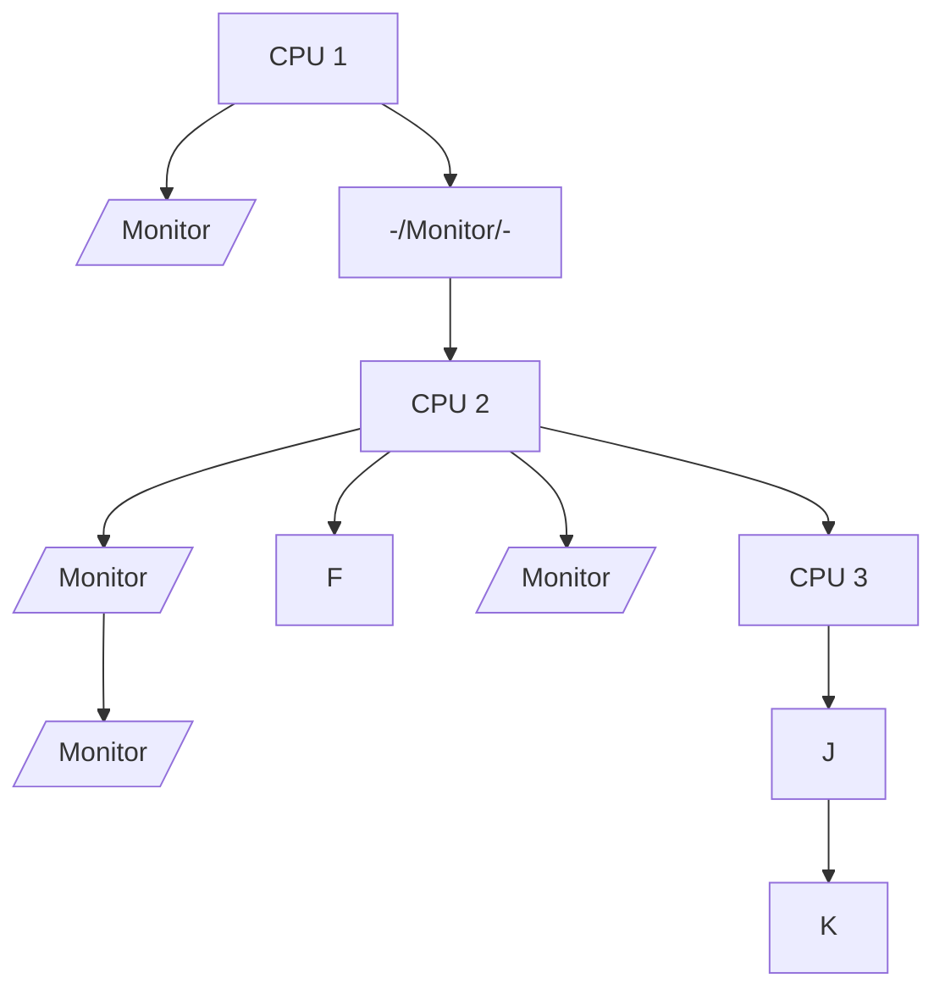

## Page 1

# SPRINT SPOOLING SYSTEM

**ND 211031 SPRINT Spooling System for ND-100/ND-500**



**ND**  
Norsk Data  

[Scanned by Jonny Oddene for Sintran Data © 2010]

---

## Page 2

# SPRINT SPOOLING SYSTEM FOR ND-100/ND-500

## INTRODUCTION

Generating and controlling computer-printed documents are very important functions in a computer environment. Depending on the workload, these tasks can become rather overwhelming at times, and it is important that proper tools be available to take care of these functions.

The SPRINT Spooling System is a print-handling system with features and functionality beneficial both to end users and supervisors.

This spooling system provides additional functionality both for the system supervisor and the ordinary user. It enables users to schedule jobs outside peak periods, make status inquiries, alter queue priorities, assign security levels and use distributed resources more efficiently.

## FEATURES

- Easy to use for end users
- Fast release of the user's terminals
- Screen and menu oriented
- End user and supervisor classification
- Data description module for different printer types
- Built-in security functions
- Multisystem processing for remote printers
- SPOOLING LIBRARY for routines used by application programs

## PRODUCT SPECIFICATION

The SPRINT Spooling System consists of several elements; what follows is a brief explanation of the more salient modules and features.

### THE PRM-HANDLER

The PRM-HANDLER module can be thought of as a kind of database for storage of device-specific information. It contains all the necessary parameters for each type of printer in service and is used only by system supervisors or user system designers.

### THE SPOOLING-LIBRARY

The SPOOLING-LIBRARY is a repository for standard print routines that can be used by application programs. These routines can include elements like pre-defined formats, pitches, fonts etc. Most of the interactive features available in the SPRINT Spooling System are offered through this module.

### STATUS/MAINTENANCE

Standard screen pictures are used to inquire about the status of printers, e.g., “Is a particular device available at this time?” The screens also allow for input to create or change printer parameters.

### HANDLES PRINTER PROBLEMS

If the computer or the printer stops, the output will continue from the point where the stop occurred, once the cause of the stop has been corrected. This can be especially important for print jobs that depend on the computer to generate numbered forms, such as checks or invoices.

---

## Page 3

# SPRINT SPOOLING SYSTEM FOR ND-100/ND-500

## SECURITY

The system may be set in a security mode so that the user sees only his or her particular entries; unauthorized users see only blanks in protected fields. The security function is set by the supervisor.

## MULTIPLE SYSTEMS

Multisystem processing enables users to take advantage of remote printers, in effect making machine boundaries transparent to the user.

## FAST EXECUTION

The SPRINT Spooling System converts the document while the printing takes place. This minimizes the time the terminal is locked before the user can go on to other tasks.

## USER CLASSIFICATION

Users are classified in two authorization groups: UE supervisor or SINTRAN user system, and public users. The first group is authorized to carry out functions which are typically unavailable to the second.

### PUBLIC USERS

The form type required for each job is verified against the current form-type setting of the printer to be used. If the types do not match, no output will be produced. A “FORM CONTROL” mechanism is also included and may be set in two positions: "ON" means that the printer will wait until the correct form is set; "OFF" means that the output will be skipped and other documents printed instead.

The user may specify different output commands:
- Stop the output
- Print at a certain time of day
- Hold (job remains in the queue without being printed)
- Set passive (job remains in the queue after printing)
- Change output form
- Change the number of copies previously specified

Documents can be moved forwards or backwards in the queue or from one printer to another. Forward movement is available only to supervisor and user system, however.

### SUPERVISOR FUNCTIONS

In addition to what has already been mentioned, the supervisor and the user system have access to several other functions.

For example:
- Hold, delete, start and restart all documents.
- Stop and start the spooling system.
- Add or delete spooling pages.
- Update the printer table.
- Update the form-type table.
- Define the spooling-system configuration.

## SCREEN EXAMPLE

This is an example of a supervisor’s screen picture:

```
SPRINT: Edit Find Select Delete 
Move, change or delete documents entries in the queue.

Printer name: | LINE_PRINTER | A | Conditon: ACTIVE | A | Form control: ON |
Form types:   | 0 A4S1       | 1 A4LE | 2 | 3 | 4 | 5

+----+---------------+------+-------+------+-------+-----+
| User  | Document name   | Size | Copies | Form | Status  | Time |
+----+---------------+------+-------+------+-------+-----+
| 1 | PETER BROWN  | MEETING-TEXT | 2s  | 4 A4S1 | PRINTING |   |
| 2 | RUTH JENNINGS| LETTER       | 1s  | 1 A4LE | PRINT    |   |
| 3 | SUPERVISION  | MEMO-DOC     | 3s  | 1 A4S1 | *PRINT   |   |
|   | RUTH JENNINGS|             |      |        |          |   |
|   | JOYCE MASTERS| TESTPROG-SYMB | 46b | 1 A4S1 | PASSIVE | 150s |
|   | SUPERVISOR   | (REPORT-OUT)  |     | 2 A4S1 | ACTIVATE | 23:00 |
+----+---------------+------+-------+------+-------+-----+

| UE user: RUTH JENNINGS     | User area: SYSTEM |
```

The first line in the screen picture always gives the time and date. As the screen is automatically refreshed every 30 seconds, the time will be updated continuously, along with the print queue.

In the above example UE user Ruth Jennings has the SYSTEM as user area. She has supervisor rights and can see the whole print queue. An ordinary user might only see his or hers entries although the number and size of the documents in the queue are displayed.

## PREREQUISITES

Prerequisites are:
- SINTRAN III operating system version J or later.

## PRACTICAL INFORMATION

The maximum number of printers in a system is 60. NOTIS-WP version N requires the SPRINT Spooling System.

## DOCUMENTATION

SPRINT SPOOLING SYSTEM  
User Manual .................................... ND-60.252.1 EN

---

## Page 4

# Norsk Data

## Corporate Headquarters

Olaf Helsets vei 5  
P.O. Box 25, Bogerud  
0621 Oslo 6  
Norway  

Tel.: +47-2-625000  
Telex: 7832 nd no  
Telex: 472-28294 (A)  
Telex: 472-28295 (A)

## Norway

Oslo, tel.: +47-2-709300  
Bergen, tel.: +47-5-213560  
Sandnes, tel.: +47-4-667500  
Trondheim, tel.: +47-7-227200  
Tromso, tel.: +47-8-917222

## ND Comtec

Head Office  
Olaf Helsets vei 5  
P.O. Box 25, Bogerud  
0621 Oslo  6  
Norway  

Tel.: +47-2-626000  
Telex: 472-28170 (A) 

Stavanger, tel.: +47-4-95860  
Telex: 73679 nri n  
Trondheim, tel.: +47-7-54754  
Telex: 55256 nrtc n  

## Sweden

ND Norsk Data AB  
Kanalvägen 11  
P.O. Box 72  
191 22 Upplands Vasby  
Sweden  

Tel.: +46-8-796-9400  
Telex: 12536 ndabta s  
Telefax: +46-8-7609247 (A)  

Goteborg, tel.: +46-31-496760  
Malmo, tel.: +46-40-70510  

### ND-Silvadata

Swedewi  
581 88 Sundsvall  
Sweden  

Tel.: +46-60-154150

Växjö, tel.: +46-470-46200  
Stockholm, tel.: +46-760-92000

## Denmark

Norsk Data A/S  
Lautrupvej 3-2  
P.O. Box 213  
2750 Ballerup  
Denmark  

Tel: +45-2-886065  
Telex: 27148 asedk (A)  
Copenhagen, tel.: +45-2-888605/681200  
Arhus, tel.: +45-6-16156

## Finland

Oy Norsk Data AB  
Keilaranta 19  
SF-02150 Espoo 15  
Finland  

Tel.: 358-0-565-022  
Telex: 125653 Nodatar psby f 

## Switzerland

Norsk Data (Switzerland) S.A  
34 Avenue de Vauduc 12  
1007 Lausanne  
Switzerland  

Tel.: +41-21-25102  
Telex: 45142 aschn ch  
Telefax: +41-21-65594 (A)  

Glattenburg (Zurich), tel.: +41-1-8101033

## West Germany

Norsk Data GmbH  
Thomasstrasse 10-12  
6309  
Bad Homburg v.d.H.  
West Germany  

Tel.: 49-6172-13360 (A)  
Telefax: 49-6172-2259 (A)  

West Berlin, tel.: +49-30-213-8906  
Hamburg, tel.: +49-40-503202  
Hannover, tel.: +49-511-696042  
Mulheim, tel.: +49-208-49224  
Stuttgart, tel.: +49-711-7300-0  
Munster, tel.: +49-251-37029-0  
Klein, tel.: +49-431-95303

## The Netherlands

Norsk Data Nederland B.V  
Brugwal 5  
P.O. Box 500  
3940 AA Nieuwegein  
The Netherlands  

Tel.: +31-340-72411  
Telex: 36931 nd nl

## France

Norsk Data S.A  
Le Brevent  
11, Avenue J. Jaurès  
F-38320  
France  

Tel.: 33-76-403576  
Telex: 380535 nod evne nv  
Telefax: 33-76-403845 (A)

## United Kingdom

Norsk Data Ltd  
Ilex House  
Benyon's Way  
Bexley Kent, DA6 8TT  
United Kingdom  

Tel.: +44-1-382-3566  
Telex: 297391 nd g nt  
Telefax: +44-1-3733754 (A)

Glasgow, tel.: +44-41-954167  
Edinburgh, tel.: +44-031-556-1687

## USA

Norsk Data N.A., Inc.  
Westborough Office Park  
198 West Park Drive  
Suite 155  
Westborough, MA 01581  
USA  

Tel.: +1-617-366-4860  
Telex: 921707 norsk well  
Telefax +1-617-366-0366 (A)  

Los Angeles, tel.: +1-714-752-5081

## Hong Kong

Norsk Data International  
1904 Wing on Centre  
111 Connaught Road  
Hong Kong  

Tel.: 852-5-419121/4903  
Tel.: 08082-65182 lucky h.k  
Telefax: 852-5-815095 (A)

## Represented by Agent in:

### India

Norsk Data (India) P. Ltd.  
Tel.: +91-44-51291/21946  

### Thailand

Norsk Data Thul.  
Tel.: +662-255-6804

### France and Italy

Mar DataSysteme S.A. Lyon  
Tel.: 33-72-344846  
Telex: 370732 novtv

Mar Datasyteme S.A  
Toulouse  
Telex: 330-342020  
Tel.: 33084

---

