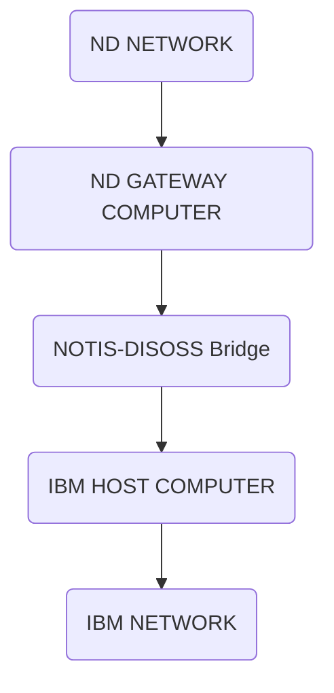

## Page 1

# NOTIS DISOSS BRIDGE

**ND 211048 NOTIS-DISOSS Bridge for ND-100**  
**ND 211127 NOTIS-DISOSS Bridge for ND-500**

```
+----------------------------------------------+
|                                              |
|            NOTIS-DISOSS BRIDGE               |
|                                              |
|                      /\                      |
|                    /    \                    |
|                  /        \                  |
|                /  ____  ____\                |
|              /  /          \  \              |
|            /__/              \__\            |
| IBM                                        ND|
+----------------------------------------------+
```


Scanned by Jonny Oddene for Sintran Data © 2010

---

## Page 2

# NOTIS DISOSS BRIDGE

## Introduction

NOTIS-DISOSS Bridge is a product in the ND-NOTIS family. Norsk Data’s Office Support System. NOTIS-DISOSS Bridge offers a means of sending documents from an ND computer to an IBM™ mainframe computer and store them under DISOSS™ and a mechanism for searching and retrieving documents stored under DISOSS.

NOTIS-DISOSS Bridge also provides tools for conversion between NOTIS-DS (NOTIS Document Storage) or SINTRAN file formats, and IBM format. Both 'DCA Revisable Form Text' and 'DCA Final Form Text' formats are handled. This facility allows ND-originated documents to be stored under DISOSS in a format that can be recognised by an IBM system and modified by tools on the IBM mainframe computer. It also allows IBM-originated documents to be modified by NOTIS-WP and other ND tools.

NOTIS-DISOSS Bridge allows the user to communicate with the system through a set of menus that are made according to the NOTIS standard, but also designed to provide a familiar environment for the experienced IBM user. NOTIS-DISOSS Bridge uses the ND COSMOS SNA gateway for connection to the IBM system.

## Features

- **Search for documents in a DISOSS archive** by specifying search criteria. The search result list can be transferred to the user on the ND computer.

- **Transfer documents from NOTIS-DS** (NOTIS Document Storage) or from the SINTRAN file system and store them in a DISOSS archive.

- **Transfer documents from a DISOSS archive** and store them in NOTIS-DS or under the SINTRAN file system.

- **Conversion of documents from NOTIS-DS or SINTRAN file format into IBM format, and vice versa.**

- **Handling both 'DCA Revisable Form Text' and 'DCA Final Form Text' formats.**

IBM and DISOSS are trademarks of International Business Machines.

---

## Page 3

# NOTIS DISOSS BRIDGE

## DISOSS

DISOSS (Distributed Office System Support) is regarded to be IBM's strategic office support product. It is an application program that runs on an IBM mainframe such as the System 370 host computer. The most important objective of DISOSS is to provide a central, high-volume document library (DISOSS Library Services). The Library Services are available on the IBM host and on all connected subsystems. NOTIS-DISOSS Bridge makes these library services available to users on an ND system via an SNA network.



## Prerequisites for Version A

- SINTRAN-III Operating System Version K or later.
- ND 210709/ND 210526 NOTIS-WP, Version N or later.
- ND 210691/ND 210794 NOTIS-DS, Version B or later.
- ND 108860 SNA Controller Singleline or ND 108640 SNA Controller Multiline
- ND 210518 USER-ENVIRONMENT, Version C or later.

## Documentation

| Document                                  | Reference  |
|-------------------------------------------|------------|
| NOTIS-DISOSS Bridge Brukerveiledning       | ND-63.044 NO |
| NOTIS-DISOSS Bridge User Guide             | ND-63.044 EN |

*Scanned by Jonny Oddene for Sintran Data © 2010*

---

## Page 4

# Contact Information

## Corporate Headquarters

**Address:**
Olaf Helsets vei 5  
P.O.Box 5, Boexrud  
0611 Oslo 6  
Norway

**Contact:**
- Tel.: +47-2-626000
- Telex: 76636 nd n
- Telefax: +47-2-293644 (A)  
- Telefax: +47-2-296768 (A)  
- Telefax: +47-2-299769 (A)

## Norway

- **Oslo:** Tel.: +47-2-393000
- **Bergen:** Tel.: +47-5-202000
- **Porsgrunn:** Tel.: +47-3-556300
- **Sandnes:** Tel.: +47-4-678700
- **Trondheim:** Tel.: +47-3-171766
- **Tromsø:** Tel.: +47-7-921222

## ND Computer

**Head Office:**  
Olaf Helsets vei 5  
P.O.Box 5, Boexrud  
0611 Oslo 6  
Norway

**Contact:**
- Tel.: +47-2-626000
- Telex: 76644 nd n
- Telefax: +47-2-293645 (A)

## Sweden

**ND Norsk Data AB**

**Address:**  
Fågelviksstränd 1  
194 70 Upplands Väsby  
Sweden

**Contact:**  
- Tel.: +46-8-590-98070
- Telex: 10583 norsdata s
- Telefax: +46-70-86229 (A)

**Locations:**
- **Gothenburg:** Tel.: +46-31-496760
- **Malmoe:** Tel.: +46-40-70510

## ND-Silvadata

**Address:**  
58 31 Sundsvall  
Sweden

**Contact:**  
- Tel.: +46-60-155150

## Denmark

**Norsk Data A/S**

**Address:**  
Lautrupbry 1-3  
P.O.Box 232  
2750 Ballerup  
Denmark

**Contact:**  
- Tel.: 45 2-689056
- Telex: 35652 nd dk
- Telefax: 452-688614 (A)

**Locations:**
- **Copenhagen:** Tel.: 45-2-680556/681200
- **Odense:** Tel.: 45-9-151440
- **Aarhus:** Tel.: 45-6-151716
- **Aalborg:** Tel.: 45-8-373216

## Finland

**Oy Norsk Data Ab**

**Address:**  
Pukinmäenaukio 2  
00720 Helsinki 71  
Finland

**Contact:**  
- Tel.: 358-0-253611
- Telefax: 358-0-345662

## West Germany

**Norsk Data GmbH**

**Address:**  
Thorsthbergen 10-12  
6300 Darmstadt 1  
West Germany

**Contact:**  
- Tel.: 49-6151/24060
- Telefax: 49-6151/26402

**Locations:**
- **Berlin:** Tel.: 49-30-78-03-806
- **Hamburg:** Tel.: 49-40-21220
- **München:** Tel.: 49-89-152682
- **Stuttgart:** Tel.: 49-711-23131-0
- **Nürnberg:** Tel.: 49-911-4797036
- **Kiel:** Tel.: 49-431-539702

## The Netherlands

**Norsk Data Nederland B.V**

**Address:**  
Brugwal 5  
P.O.Box 50, 3430 AM Nieuwegein  
The Netherlands

**Contact:**  
- Tel.: +31-340-72411
- Fax: +31-340309040 nl nl

## France

**Norsk Data s.r.l**

**Address:**  
5 ave Buerauts,  
Centre d'Affaires, 01710 Fernay-Voltaire  
France

**Contact:**  
- Tel.: 33-50-405706

## Switzerland

**Norsk Data (Switzerland) S.A**

**Address:**  
Chemie da Vidue 12  
CH-1006 Pully-Lausanne  
Switzerland

**Contact:**  
- Tel.: 41-21-25102
- Telefax: 41-21-55658 (A)

**Locations:**
- **Geneva:** Tel.: 41-22-9800
- **Glattbrug (Zürich):** Tel.: 41-1-8101033

## United Kingdom

**Norsk Data Ltd**

**Address:**  
Deanway, Berks RG16 8LU  
Newbury Kempb

**Contact:**  
- Tel.: +44-635-393636

**Locations:**
- **London:** Tel.: +44-1-388-9605
- **Manchester:** Tel.: +44-61-925-3880
- **Edinburgh:** Tel.: +44-31-558-1666

## Ireland

**Address:**  
Norsk Data Ireland Ltd.  
5A Industrial Estate, Learney Avenue  
Dublin 9, Ireland

**Contact:**  
- Tel.: 353-1-447246

## USA

**Norsk Data, N.A. Inc**

**Address:**  
Westborough Office Park  
1800 West Park Drive, Suite 106  
Westborough, MA 01581  
USA

**Contact:**  
- Tel.: +1-617-366-0862
- Telefax: +1-617-366-0366 (A) 

**Locations:**
- **Los Angeles:** Tel.: +1-714-752-5081

## France and Italy

### France: Matra Datasyteme S.A

**Address:**  
Paris, France

**Contact:**  
- Tel.: 33-99398000

### Italy: Matra Datasyteme S.A

**Contact:**  
- Tel.: 33-993979

### Matra: Datasyteme S.A., Lyon

**Contact:**  
- Tel.: 33-744269

### Matra: Datasyteme S.A., Toulouse

**Contact:**  
- Tel.: 33-614340

---

# ND International Operations

**Address:**  
Olaf Helsets vei 5  
P.O.Box 5, Boexrud  
0611 Oslo 6  
Norway

**Contact:**  
- Tel.: 47-2-626000  
- Telefax: 47-2-293644 (A)

# Represented by Agents and Distributors

## Hong Kong

**Norsk Data International**

**Contact:**  
- Tel.: 852-511912/42053  

## Iceland

**Norsk Data Iceland**

**Contact:**  
- Tel.: 354-1-4413/11314

## India

**Norsk Data (India) Pvt. Ltd.**

**Contact:**  
- Tel.: 91-482500 [illegible]

## Pakistan

**Norsk Data Pakistan (Pvt) Ltd.**

**Contact:**  
- Tel.: 92-51-815-664

## Saudi Arabia

**Norsk Data, C/O Advanced Systems Ltd.**

**Contact:**  
- Tel.: 495-406361 alisco 

## Thailand

**Norsk Data Thai Ltd.**

**Contact:**  
- Tel.: 66-2-253-6604

---

```
   _______  __    ______    
  / / ___ \/ /_  / __ \ | /|
 / / /__/ / _ \/ /_/ / |/ / 
/_/\___/_/_.__/\____/|___/  
```

---

