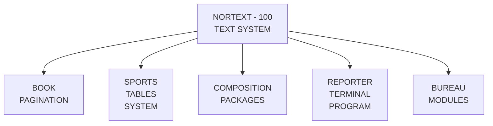
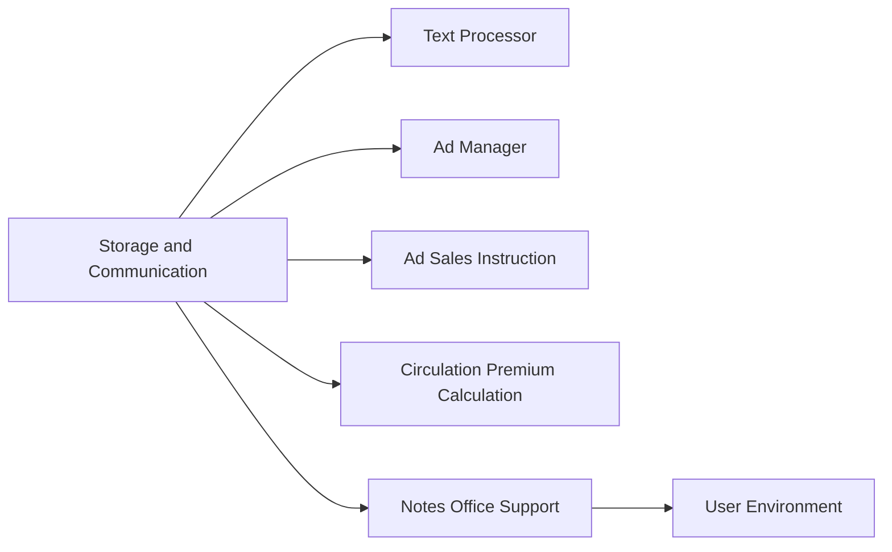

## Page 1

# NORTEXT
## BASIC COMPOSITION PACKAGE

ND-211055



```
 ND
 COMTEC
 DIVISION OF NORSK DATA
```

---

## Page 2

# NORTEXT Basic Composition Package

## Product Summary

The purpose of the NORTEXT Basic Composition Package is to provide a user-friendly tool for article make-up, by using global and local formats in the NORTEXT formatting system. The NORTEXT Basic Composition Package is based on the NORTEXT Text system, version K.

The NORTEXT Basic Composition Package consists of one format file named:

```
(FLOPPY-USER)BASIC-FORMATS:DATA
```

In addition several files with coded examples are parts of the package. The filenames are printed on the example sheets which is also part of the NORTEXT Basic Composition Package. The examples are justified with an AGFA P400 tabfile and may not fit other typesetters or advanced printers.

The format file contains up to 200 formats with a size of 1024 characters each. A continued space of 103 pages is required for the format file.

The format file must be created for LAMU use.

The formats in the NORTEXT Basic Composition Package may be modified or adjusted.

## Requirements

- ND-210800 NORTEXT Editor for ND-110
- ND-103220 NORTEXT Editing terminal - NET (green-green); or:
- ND-110003 NORTEXT Editing terminal - NET (black-white)
- ND-103270 Graphic Option module

The users of the NORTEXT Basic Composition Package must be familiar with both local and global formats in the NORTEXT Text System and with the Function Code Arithmetics.

## Documentation

| Document Number       | Title                                 |
|-----------------------|---------------------------------------|
| ND 61.051.1 EN NORTEXT | Basic composition package             |
| ND 61.035.1 EN NORTEXT | Editor                                |
| ND 61.029.1 EN NORTEXT | Typographic Functions Codes           |
| ND 61.030.1 EN NORTEXT | Typographic Maintenance               |

**NOTE:** ND COMTEC reserves the right to change specifications without notice.

---

## Page 3

# The Nortext Solutions

As the leading European manufacturer of total integrated computer systems for the media industry, ND COMTEC has been helping customers to improve their efficiency and profitability since 1967. The NORTEXT family of software allows users to satisfy the requirements found in the Production, Editorial and Administrative Departments as well as offering the new tools that modern management needs for decision making processes.



## Highlights of the Integrated Nortext Concept

- NORTEXT offers the full range of typographical commands. Both simple and complex work may easily be tackled with the aid of a powerful advanced format system. The NORTEXT Text System drives all modern digital photo typesetters and a range of intelligent printers.

- The Graphic Option gives a "soft copy proof" of display ads, articles or page plans on the standard terminal — the NET terminal.

- In the Editorial departments, extensive editing and routing facilities are provided with the additional benefits of the soft copy facility — the Graphic option — and an electronic archive.

- The NORTEXT users have the ability to input data and receive information through remote or portable terminals.

- The handling of all types of advertising implies not only the production of the correct sorted output with classification titles inserted, but also a fully interactive entry of all the required administrative data. Accurate pricing and statistical information means more efficiency and higher profits.

- Newspapers and magazines can have an on-line system with immediate updating functions for registration, follow-up and control of subscription, retail sales and distribution.

- Office Support products — the NOTIS family of software — such as word processing, spreadsheet, business graphics and database handling are available for the NORTEXT users thanks to the use of a standard operating system.

Most important of all, as your needs grow you won't have to worry about your existing NORTEXT systems becoming out-of-date — because they will always be capable of integration with any additional hardware and software from ND COMTEC. The integrated NORTEXT solution is based on the concept of compatible hardware, flexible software, ND-COSMOS network system and a common operating system — all elements of the ND-SAFE concept (Systems Architecture For Expansion).

---

