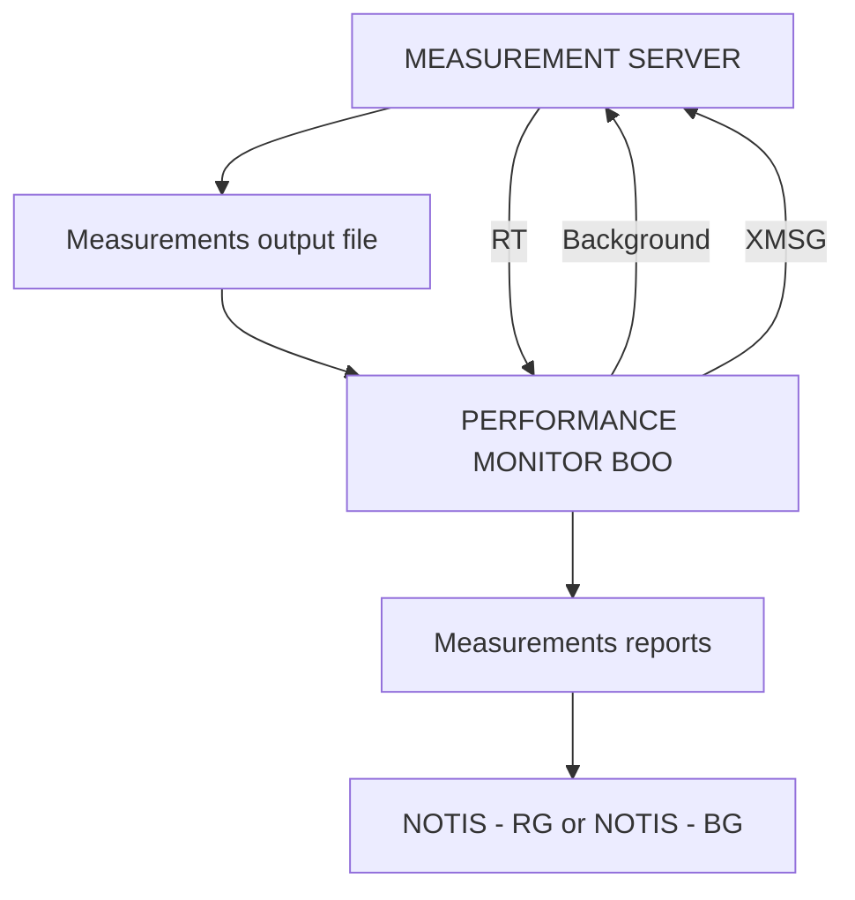

## Page 1

# PERFORMANCE MONITOR

*ND 211074 Performance Monitor for ND-100/500/5000*



```
     ND
Norsk Data
```

*Scanned by Jonny Oddene for Sintran Data © 2010*

---

## Page 2

# PERFORMANCE MONITOR

## Introduction

A computer system can be tuned according to the current use of hardware and software. Measurements made by the Performance Monitor make it easier to retrieve the information needed to make the most out of a computer system.

Performance improvements on a computer installation can be very valuable, both in terms of hardware expenses saved, and in terms of increased user productivity.

Measurements enable you to evaluate software performance in a mixed computer environment. In addition, an understanding of the performance status of an existing system is a prerequisite for sound decisions regarding upgrading of the system.

Performance Monitor consists of a user interface part which controls the Measurement Server. The Measurement Server initiates, runs and stops measurements based on user specifications. It also stores results on files and/or reports them back to the user's terminal.

## Product description

Measurements are divided into log macros. A log macro consists of one or more log primitives, each representing a measurable resource in the computer.

The Performance Monitor has a menu with six options:

```
+---------+-------+-------+--------+-------+
| DIAGNOSE| START | STOP  | EDIT   | REPORT| EXIT |
+---------+-------+-------+--------+-------+
```

With the EDIT command, you modify the parameters for a log macro, i.e., how and when the measuring should be run. The measurements are started by the START command, where you specify which log macro to run. Measuring can be stopped with the STOP command. The REPORT command gives you statistical results from the last or the ongoing run of a log macro.

When the DIAGNOSE command is used, a standard system-defined set of measurements is run. When the user returns to the menu, a simple performance evaluation of the system will be displayed on the screen.

## Features

- The DIAGNOSE option gives you a simple evaluation of the overall system performance, and does not require any technical parameters from the user.
- In addition, the supervisor can create detailed patterns for what the Performance Monitor should measure. It is usually possible to see both the total use of each resource and the share used by a specific program. Thus, each supervisor can check the system performance according to the vital needs of a specific installation.

Five log macros are available in the Performance Monitor:

| Log Macro     | Description                                                      |
|---------------|------------------------------------------------------------------|
| SYSTEM LOG    | Measures the use of CPUs, disks and swapping activity.           |
| LOG DEVICES   | Measures the use of SINTRAN logical devices, like terminals and printers. |
| MON-CALLS     | Measures the use of monitor calls.                               |
| SEGMENT LOG   | Measures the use of memory by active segments.                   |
| HISTOGRAM     | Measures the use of different parts of a logical segment's address area. |

Results can be printed on a file. Performance Monitor offers two formats: one where measurements can easily be read directly through an editor like NOTIS-WP, and another suited for further treatment in NOTIS-RG and/or NOTIS-BG. Through the online REPORT option, some statistical information from the last or the ongoing execution of a log macro can be displayed on the screen.

## Prerequisites

- SINTRAN-III version K500
- XMSG

## Documentation

Performance Monitoring, Tuning and Capacity Planning............................... ND-30.083.1 EN

```
CORPORATE HEADQUARTERS
Tel: +47-2-628000

NORWAY
Tel: +47-2-628000

SWEDEN
Tel: +46-760-98400

DENMARK
Tel: +45-2-68655

FINLAND
Tel: +358-0-368811

UNITED KINGDOM
Tel: +44-635-35544

WEST GERMANY
Tel: +49-6172-4800

BELGIUM
Tel: +32-2-7251560

FRANCE
Tel: +33-1-493711200

IRELAND
Tlf: +353-1-47244

LUXEMBOURG
Tel: +352-486716/8/9

THE NETHERLANDS
Tel: +31-3402-72411

SPAIN
Tel: +34-3-2152257+

SWITZERLAND
Tel: +41-21-250122

HONG KONG
Tel: +852-5-411912/412063

USA
Tel: +1-617-366-4662

ICELAND
Tel: +354-1-673711

INDIA
Tel: +91-44-119217/119126

PAKISTAN
Tel: +92-51-581446

THAILAND
Tel: +66-2-253-9892/4

ND COMTEC HEADQUARTERS
Tel: +47-2-628000

ND COMTEC AUSTRIA
Tel: +43-7266-5335

ND COMTEC USA
Tel: +1-316-636-5000
```

Scanned by Jonny Oddene for Sintran Data © 2010

---

