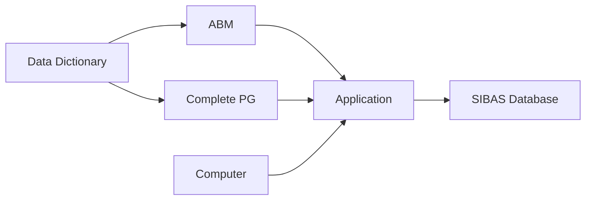
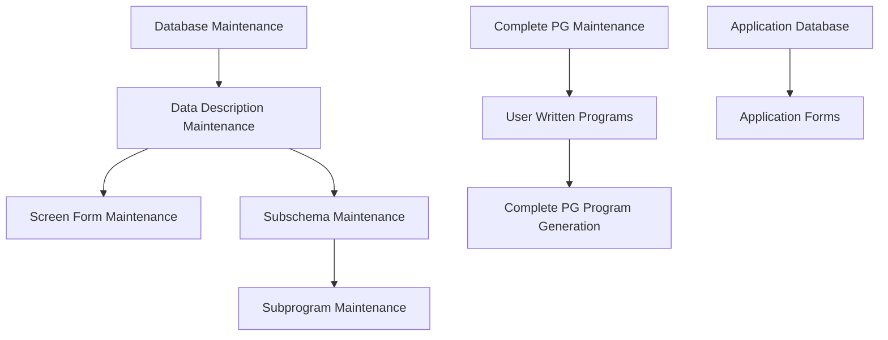

## Page 1

# Application Building and Maintenance

ND 211106 ABM with COMPLETE PG for ND-100  
ND 211107 ABM with COMPLETE PG for ND-500



![Norsk Data Logo]

Scanned by Jonny Oddene for Sintran Data © 2021

---

## Page 2

# APPLICATION  
BUILDING AND MAINTENANCE

## Introduction

The Application Building and Maintenance (ABM) System and COMPLETE Program Generator (PG) are tools for secure and fast development and maintenance of application programs together with SIBAS Database Management System.

ABM with COMPLETE PG is part of DIALOGUE, a set of development and end-user tools for administrative data processing.

These two systems are based on COBOL or FORTRAN programming. They will therefore have the benefit of efficient utilization of computer resources, although the development method also gives the benefits from fourth-generation systems.

The main product is ABM and COMPLETE PG, but ABM is available as a single product. COMPLETE PG, however, is based on ABM but can be ordered as an upgrade for those who start with ABM.



## Product Description

### The ABM System consists of 2 parts:

1. An interactive system for the definition of data descriptions, databases, screen forms, database subschemas, subprograms, and generation of COBOL COPY and FORTRAN INCLUDE files. This includes all necessary information for screen-form and database manipulation. Files for initiation and redefinition of SIBAS databases will also be generated.
2. Subroutines called by the application programs to take care of communication with SIBAS and screen, and transfer of data between SIBAS and screen-buffers.

### How ABM can be used in application program development

1. Define and format data descriptions. The data description format will guarantee that the data description will be format consistent in all screen forms, database, and application programs.
2. Online definition of application database(s). When an item is defined, the data description is referred to. When parts of, or the whole database has been defined, ABM will on command produce a database initiation file to be input to SIBAS-DRL.
3. Online creation of screen forms. The screen forms will have the same screen layout when used in application programs as they have during definition. Every field in a screen form must have a reference either to an item in a database or to a data description. You may define one or more record types in your screen form, and every record type may have one or more occurrences. Therefore, a screen form is in its concept, a database with realms, records, and items, and the application program consequently navigates — by means of the ABM subroutines — within a screen form as if it were a database. This approach simplifies the application program's navigation within a screen form.
4. Online definition of subschemas, i.e. which part of a database is to be used in a specific application program.
5. Online definition of functions, i.e. which subschemas are to be connected to which screen forms.
6. Online creation of FORTRAN INCLUDE and/or COBOL COPY files with data definitions and value assignments for use in application programs.
7. Initiate or redefine your SIBAS database with the SIBAS-DRL file produced by ABM.
8. Compilation and loading of FORTRAN and COBOL application programs which use the INCLUDE or COPY files and call the subroutines in ABM to take care of the transfer of data between screen form, application program, and database.

## ABM

The ABM-system is used for the definition of databases and screen pictures for the applications for further development in COBOL or FORTRAN or COMPLETE PG. Data definitions are stored and maintained in the data dictionary, and can be used through the development period and in later work. The screen definition is based on FOCUS Screen Handling System.

ABM gives the developer the skeleton of application systems with a substantial reduction in programming effort. It is normal to achieve up to 50% reduction in man and machine cost compared to traditional design and programming.

## Features

- ● Reduces application program development and maintenance time for programs written in FORTRAN and COBOL.
- ● Relieves the system analyst and programmer from declaring data definitions every time they are needed.
- ● Simplifies definition and redefinition of databases and forms.
- ● Ensures data definition consistency in all application programs, databases, and forms.
- ● Subroutines to simplify communication between application programs, databases, and forms.
- ● Subroutines to take care of the transfer of data from SIBAS- to form-buffers and vice versa.
- ● ‘SIBAS’ approach in reading/writing from/to forms.

## Comparison Table

| WITHOUT ABM | WITH ABM |
|-------------|----------|
| find out which application programs, screen forms, and databases use the data (do we have an updated cross-reference?) | change the data description in the dictionary, ABM will prepare for the following actions: |
| modify all affected screen forms | Y (automatic) |
| recompile these forms | Y (flagger by ABM) |
| make database redefinition commands | Y (all changes since last redefinition included) |
| execute the redefinition | execute the redefinition |
| modify all programs that reference the data | Y (make new COPY code of flagged suffocations) |
| recompile these programs | recompile these programs |

---

## Page 3

# APPLICATION BUILDING AND MAINTENANCE

## How AMB may be used in application program maintenance

The ABM is as likely to be effective in application program maintenance as it is in application program development. A trivial task like the changing of the format of a data description used in databases, screen forms and application programs could be taken an example.

## COMPLETE PROGRAM GENERATOR

### Introduction

COMPLETE PG is a program generator to be used together with ABM, which is a 4th-generation tool for the definition of databases and screen pictures.

COMPLETE PG generates ready-to-run COBOL code for querying, creation, updating and deletion of database records/items through the user-defined screen pictures.

The combination of ABM and PG provides a very strong solution for application development and maintenance. Traditional programming in COBOL has advantages in computer utilisation and may often be the only solution in very complex programs. The drawback, however, is that it is time-consuming, that it demands qualified personnel and that the end users can seldom contribute during the development period. With ABM and PG these drawbacks are essentially reduced, and the advantages from the COBOL programming is retained.

PG can also generate FORTRAN code. (ANSI 74).

These pictures show the benefits when using a program generator for development of applications.

```
 A P P L I C A T I O N S
 C O M P L E X I T Y

                     COMPLETE PG
     
  Traditional tools
    
 |--------------------------------|
 |                                 \
 |                                  \
 |                                   \
 |                                    \

 Saved hours             PROJECT HOURS
```

*This picture shows the reduction in man-hours when COMPLETE PG is used, and even how the ambition level can be increased in comparison with the use of traditional programming, because the time saved can be better utilised.*

### Features

- Very fast program development because the programs are generated automatically from a functional description
- Programs are based on well-proven and tested subroutines
- Standardised development procedures which reduce time consumption and make the programs less dependent on the development personnel
- Uses NOTIS standard function keys
- High flexibility concerning changes and maintenance 
- The applications use of computer resources is the same as for ordinary COBOL programs
- Problems of multiuser database updating are handled automatically. (critical sequences)
- Automatic existence control
- The users of the applications can make their own help forms for specific needs
- Free text can be linked to fields in the screen picture

### Product Description

PG is based on screen pictures made with FOCUS, the standard screen-handling system which is a part of ABM. It is very simple to use because there is no procedure language involved which has to be learned. The definition of the routines is made by filling in two menus which are presented by the system.

The menus are filled in through a dialogue with the system, thus describing the functions in the routines.

After the input phase is ended, the program generation can start.

The programs generated by PG are short and compact. The main part of the code is stored as standard, powerful subroutines.

Complex function which cannot be solved with PG can be manually programmed. These parts are placed on separate files. When the user wants to change functions in PG, with successive regeneration of the program, the manual parts will come into the correct place in the program.

```
   C  
   P  
   U  
 R  
 E  
 S  
 O  
 U  
 R  
 C  
 E  
 S  

  4 th-generation
                   COMPLETE PG
                         ●
                             COBOL/FORTRAN
                                          ●

                                                Assembler

DEVELOPMENT TIME
```

*When COMPLETE PG is used, the result will be applications which use the same computer resources as one would get with traditional programming.*

---

## Page 4

# Product Specifications

There will be several product versions for ABM and PG.

- ND 211106 ABM with COMPLETE PG FOR ND-100
- ND 211107 ABM with COMPLETE PG FOR ND-500
- ND 210713 ABM for ND-100
- ND 210718 ABM for ND-500
- ND 211108 COMPLETE PG FOR ND-100
- ND 211109 COMPLETE PG FOR ND-500

The two last products require that ABM is installed on the system.

In addition, Runtime versions will be available for all products. Runtime versions are sufficient for running applications made on another computer system.

# Requirements

- SINTRAN Operating System
- SIBAS-II Database Management System
- ABM (for the COMPLETE PG products)

# Documentation

| Document                 | Number        |
|--------------------------|---------------|
| ABM User Manual          | ND-60.203 EN  |
| COMPLETE PG User Manual  | ND-60.219 EN  |

```
   __  __            
  |  \/  | ___  _ __  
  | |\/| |/ _ \| '_ \ 
  | |  | | (_) | | | |
  |_|  |_|\___/|_| |_|

     Norsk Data
```

---

