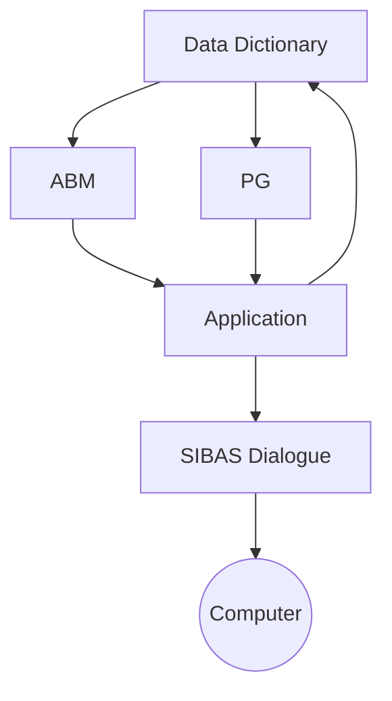
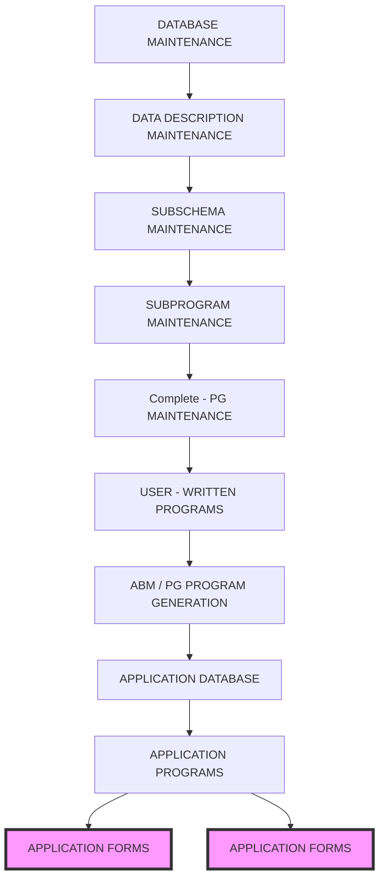

## Page 1

# ABM Application Building and Maintenance

ND 211109 DIALOGUE-3 for ND-500/5000  
ND 211107 ABM/PG for ND-500/5000  
ND 211267 ABM Tool for ND-500/5000  



![Logo: Norsk Data]

---

## Page 2

# ABM Application Building and Maintenance

## Introduction

ABM/PG is the 4GL tool in the DIALOGUE 3-Program Development Package, consisting of tools for the development and maintenance of application programs which use the SIBAS Database Management System. The modules are:

| Module       | Function                                      |
|--------------|-----------------------------------------------|
| ABM/PG       | Database design, application development and maintenance |
| Report Generator (RG) | Report design and production                     |
| TRUE Basic System | Transaction monitoring                        |
| TRUEMAN      | Program and user administration                 |

This data sheet only deals with ABM/PG. The other modules are described in separate data sheets.

ABM/PG is an interactive system for the definition of data descriptions, databases, screen forms, database subschemas, subprograms and the generation of COBOL or FORTRAN programs. This includes all necessary information for screen-form and database manipulation. Definition code for SIBAS databases will also be generated.

The fact that ABM supports COBOL or FORTRAN program development will give efficient utilization of computer resources, combined with the benefits associated with fourth-generation systems. ABM gives the developer the skeleton of the application systems with a substantial reduction in programming effort. PG, the program generator part, generates additional code for querying, creating, updating and deleting database tables through the user-defined screen forms.

Data descriptions are stored and maintained in a data catalogue, for use throughout the development period and subsequent life cycle. The screen definition is based on the FOCUS Screen Handling System, which is an integral part of ABM/PG.



*The illustration shows the connection between the different modules in the system.*

ABM/PG provides a very powerful tool for application development and maintenance. Traditional programming in COBOL or FORTRAN is sometimes necessary to avoid overloading the system when running very complex programs. The drawback, however, is that it is time consuming, and the specific programming skills required mean that end users are prevented from making a useful contribution during the development period. With ABM/PG these drawbacks are minimized, while retaining the advantages from “manual” programming.

## Features

- A single description of each data element ensures consistency and reduces work
- Simple definition and redefinition of databases
- A powerful screen design module for defining forms
- Full support of extended character set (teletex format), which is unique among 4GL tools
- Automatic program generation from a functional description
- Multiuser database updating is handled automatically, providing critical-sequence control
- Automatic data verification (existence control)
- Simple, standardised linkages to databases and display forms through tried and tested subroutines
- High flexibility concerning changes and maintenance
- Free-text documents can be linked to screen form fields
- Application users can create individual help-forms for specific needs
- Automatic generation of system documentation
- Uses ND-NOTIS standard function keys

## Product Description

### Database Definition

Data descriptions and formats are defined interactively, and kept in a common catalogue to guarantee consistency between databases and corresponding screen forms and application programs. When the relationships between the elements have been defined, ABM will generate a symbolic initiation file to establish and document the database.

Several databases may be defined in one ABM catalogue. A subschema may be defined to select part of a database for use in a specific application program. The catalogue may be referenced via a “help” facility, allowing searching and the selection of information from a list. This information is displayed in a “window” overlay to the main screen form (as in User Environment), and a “sticky cursor function” makes it possible to mark an element in the list and copy it into the form.

ABM can also “import” and redefine an existing database schema, to extend existing application systems.

---

## Page 3

# ABM Application Building and Maintenance

ABM/PG supports the wide column feature of SIBAS/R for storing documents as part of a database table. The user is given full text-processing functionality for writing and editing.

## Screen Form Design

Screen forms are laid out in a full-screen definition mode, referring to elements which are either a data description or a database column. Each field may be given a specific emphasis, such as a different intensity, inverse video or blink. Extended character sets with graphical and mathematical symbols and national characters with accents and diacritics are supported.

A form may include a table of recurring records of data. A navigation concept simplifies the program interface to this kind of form. Form definitions may also be given in an ND-NOTIS document. This mechanism may be used for conversion from other implementations.

## Application Programming

The PG module will generate the additional coding required to describe the functions of the completed application program. There is no procedure language involved which has to be learned - the functions are selected in a menu dialogue with the system.

The programs generated by PG are short and compact, since the main part of the code consists of calls to powerful standard subroutines. These subroutines are automatically included to take care of communication with SIBAS and the screen, and the transfer of data between the database and the screen forms. Complex program code which cannot be handled by PG can be manually programmed.

The form overlay technique described above is also available in the applications, to move information from one application to another.

## Maintenance

- User-defined (manual) program code is placed in separate files, so that when the user makes function changes in PG, with subsequent regeneration of the program, the manual parts will be put into the correct place in the program.

If a data description is modified or some screen form is changed, ABM will make all the necessary adjustments, using a cross-reference:
  - modify all screen forms affected, and flag for recompilation
  - produce an updated database redefinition, and execute it
  - produce new program code

## Office Applications

Office applications for NOTIS-DM are defined with the ABM Tool. This is done by defining screen forms and filling in forms for the office-application definition.

## Product Specifications

| Product                      | ID       |
|------------------------------|----------|
| DIALOGUE-3                   | ND 211209|
| ABM/PG                       | ND 211107|
| ABM Tool                     | ND 211267|
| DIALOGUE-3 Runtime           | ND 211209|
| ABM/PG Runtime               |          |

The runtime versions are provided for distributing applications made on one system to others which do not require the development facilities.

## Requirements

The ABM Tool is enough for defining NOTIS-DM office applications.

- SINTRAN Operating System
- SIBAS Database Management System

## Documentation

| Document                                           | ID        |
|----------------------------------------------------|-----------|
| DIALOGUE-ABM Application Definition                | ND-860293 |
| DIALOGUE-ABM Application Programming               | ND-860294 |
| DIALOGUE-ABM/PG Application Development            | ND-860219 |

```ascii
     +-----------+       
     | ABM / PG  |       
     +-----------+
         |
         | Productivity /
         | Linearity
         |
         V
+(Traditional Tools)+
         |
         V
    (Saved Hours)
  ----------------------------
    Project Hours
  ----------------------------
  
```

```ascii
   +-----------------------+
   | Programming time is   |
   | reduced by using PG.  |
   | The ambition level can|
   | even be increased,    |
   | compared to traditional|
   | programming, since the|
   | resources are better  |
   | utilised in the project.|
   +-----------------------+
 
   +-----------------------+
   | ABM/PG produces      |
   | application code which|
   | uses the same or fewer|
   | computer resources in |
   | comparison with       |
   | traditional           |
   | programming.          |
   +-----------------------+

   |
   V
+-----------------+      -------------------------+
| 4th Generation  |      +-------+------+------+
+-----------------+      | ABM/PG | COBOL/ | ASSEM- |
                               |          | FORTRAN| BLER   |
V
(Development Time)

```

---

## Page 4

```
| CORPORATE HEADQUARTERS | WEST GERMANY           | SPAIN         | PAKISTAN            |
|------------------------|------------------------|-------------- |--------------------|
| Tel. 47-2-626000       | Tel. 49-6172-4080      | Tel. 34-3-2152287 | Tel. 92-51-851446 |

| NORWAY                 | BELGIUM                | SWITZERLAND   | THAILAND           |
|------------------------|------------------------|-------------- |--------------------|
| Tel. 47-2-628000       | Tel. 32-2-7551560      | Tel. 41-21-250122 | Tel. 66-2-253-9882/4 |

| SWEDEN                 | FRANCE                 | HONG KONG     | NDCOMPTEC HEADQUARTERS|
|------------------------|------------------------|-------------- |------------------------|
| Tel. 46-760-98400      | Tel. 33-1-45371200     | Tel. 852-5-411912/412053 | Tel. 47-2-628000 |

| DENMARK                | IRELAND                | USA           | NDCOMPTEC AUSTRIA    |
|------------------------|------------------------|-------------- |----------------------|
| Tel. 45-2-686055       | Tel. 353-1-427244      | Tel. 1-617-366-4662 | Tel. 43-2266-5335 |

| FINLAND                | LUXEMBOURG             | ICELAND       | NDCOMPTEC USA       |
|------------------------|------------------------|-------------- |---------------------|
| Tel. 358-0-358811      | Tel. 352-496181/6/7/8/9| Tel. 354-1-673711 | Tel. 1-316-636-5000 |

| UNITED KINGDOM         | THE NETHERLANDS        | INDIA         |                      |
|------------------------|------------------------|-------------- |---------------------|
| Tel. 44-635-35454      | Tel. 31-3402-72411     | Tel. 9144-419217/419126 |                    |
```

---

