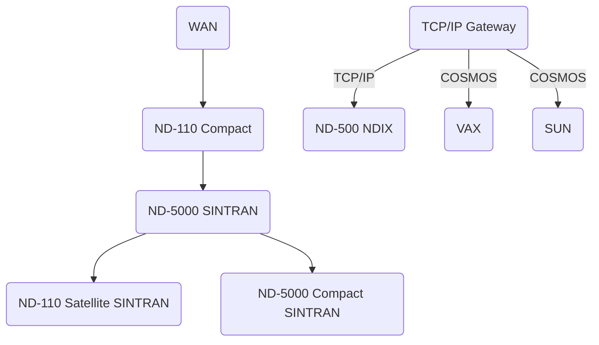
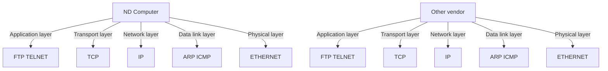

## Page 1

# COSMOS - TCP/IP INTEGRATION

**ND 211185 COSMOS TCP/IP GATEWAY**  
**ND 211154 COSMOS TELNET/FTP CLIENT**



```
     +------------------+
     |      ND-110      |
     |     Compact      |
     +------------------+
                 |
     +------------------+
     |      ND-5000     |
     |      SINTRAN     |
     +------------------+
       /           \
 +--------+    +------------------+
 |  WAN   |    |      ND-110      |
 |        |    |    Satellite     |
 +--------+    |     SINTRAN      |
               +------------------+


       +------------------+
       |      ND-5000     |
       |     Compact      |
       |     SINTRAN      |
       +------------------+
```

### ND Norsk Data

[Scanned by Jonny Oddene for Sintran Data © 2010]

---

## Page 2

# ND 211185 COSMOS TCP/IP Gateway
## ND 211154 COSMOS Telnet/FTP Client

### Introduction

The TCP/IP - Ethernet set of data-communication protocols is a de facto standard for networking in a multi-vendor environment. The TCP/IP class of products will allow ND and non-ND computers to communicate within the same network.

Functions for the users are remote log-on to/from other vendors and file transfer to/from other vendors.

With the COSMOS TCP/IP products it is possible to run full-screen applications on other vendors' computers as if you were physically connected to them. The only requirement is a VTM table which the remote computer can understand (veg. VT-100).

Most vendors now support the TCP/IP standards, but there are still a few incompatible implementations. To verify the communication between ND and each new non-ND vendor, ND or the customer should test and verify the TCP/IP communication protocols. Norsk Data's head office has a list of TCP/IP vendors who conform to ND's TCP/IP implementation.

### Features

- **Log-on** to and from other vendors like DEC, IBM, Unisys, NCR, Honeywell Bull, SUN, Apollo and others who have implemented the TCP/IP protocols.
- **File Transfer** to and from other vendors like DEC, IBM, Unisys, NCR, Honeywell Bull, SUN, Apollo and others who have implemented the TCP/IP protocols.
- Telnet provides remote terminal access for 16 simultaneous users.
- FTP allows 4 file transfers simultaneously.
- Multiple files transferred in one operation and with one command.
- Files can be transferred as batch or mode jobs at specified time intervals.

### Benefits

- TCP/IP is now a de facto standard for communication between different vendors.
- TCP/IP is independent of operating systems.
- It is possible to run full-screen applications on other vendors' computers as if you were physically connected to them.
- All ND computers in a COSMOS network can share one COSMOS TCP/IP Gateway.
- Separate controller (Motorola 68000) for the IP and Ethernet communication protocols reduces the main CPU overhead.
- Easy to connect or remove computer to or from the TCP/IP Ethernet.
- COSMOS and TCP/IP protocols on the same physical Ethernet.

### Product Description

Norsk Data has implemented the IP protocol of the COSMOS TCP/IP (Gateway as a separate controller with its own processor (Motorola 68000) and its own memory (1/2 Mbyte). This relieves the main CPU of much of the overhead from the communication protocol handling. The controller is the same as for COSMOS over Ethernet (ND-110063 Ethernet II Controller).

The Telnet/FTP Server is part of the COSMOS TCP/IP Gateway and resides in the same ND host as the TCP/IP. The Telnet Server program allows remote terminal access to USER ENVIRONMENT or SINTRAN for users of non-ND hosts or workstations connected to the TCP/IP network. The FTP Server program allows file transfer between any non-ND host on the TCP/IP network to SINTRAN or NOTIS-DS.

The COSMOS Telnet/FTP Client software may reside in any ND-100/500/5000 system within a network with a COSMOS route (LAN or WAN) to the COSMOS TCP/IP Gateway. The COSMOS Telnet/FTP Client is the user interface for the TCP/IP protocols and is always installed on your local ND computer. All ND computers in a COSMOS network can share one or several COSMOS TCP/IP gateways. The Telnet Client allows local users to access non-ND hosts through the COSMOS TCP/IP Gateway and the FTP Client allows local users to transfer files to a non-ND host.

The product consists of:

- ND 211185 COSMOS TCP/IP Gateway (including Telnet/FTP Server)
- ND 211154 COSMOS Telnet/FTP Client

```mermaid
graph TD;
    A[ND computer A] -->|COSMOS (LAN or WAN)| G[ND computer B];
    G -->|Telnet Client| J[Host A SINTRAN];
    A -->|Telnet/FTP Client| J;
    A -->|ND 211185 COSMOS TCP/IP Gateway for Ethernet| J;
    J -->|ND-110063 Ethernet II Controller| K[Ethernet];
    K -->|Ethernet| L[NDX includes TCP/IP Implementation];
    K -->|Ethernet| M[TCP/IP Implementation];
    L -->|ND Host B| N[ND NDX];
    M -->|Host C Non-ND| O;
    M -->|ND-107070/101 Transceiver Cable| H;
    H -->|ND-107470 Transceiver| K;
```

*Figure 1. A hardware/software configuration allowing all computers to communicate with each other - independent of vendor, operating system, and location.*

For security reasons it is not possible to log on directly to an ND computer in a COSMOS network. The user must first log on to the COSMOS TCP/IP Gateway computer and from this computer use COSMOS. This means that each user (from another vendor) must pass through ND's security system in USER ENVIRONMENT.

---

## Page 3

# ND 211185 COSMOS TCP/IP GATEWAY
## ND 211154 COSMOS TELNET/FTP CLIENT

### Protocols

The two protocols TCP, Transmission Control Protocol, and IP, Internet Protocol, were originally specified for ARPANET. ARPANET is a network used by the American defence organisations.

In terms of the OSI model, TCP is a layer 4 transport protocol and IP is a layer 3 network protocol.

ND's TCP/IP implementation for SINTRAN is based on the UNIX® 4.2 BBN implementation.



*Figure 2. The layers in terms of the OSI model.*

The following standards are implemented by Norsk Data:

| Layer                    | Standard                       |
|--------------------------|--------------------------------|
| Presentation/Application | Telnet: RFC 854<br/>FTP: RFC 959, RFC 765 |
| Transport                | TCP: RFC 793                   |
| Network                  | IP: RFC 791<br/>ICMP: RFC 792<br/>ARP: RFC 826<br/>IP Reassembly: RFC 815 |
| Data Link                | Baseband Ethernet: DIX 2.0     |
| Physical                 | Ethernet Accessories: IS 802.3 |

### Abbreviations

- ARP: Address Resolution Protocol
- ARPANET: Advanced Research Projects Agency Network
- BBN: Bolt Beranek and Newman Inc.
- FTP: File Transfer Protocol
- ICMP: Internet Control Message Protocol
- IP: Internet Protocol
- ISO: International Standard Organisation
- OSI: ISO's Open Systems Interconnection
- RFC: Request For Comments (TCP/IP working paper)
- SMTP: Simple Mail Transfer Protocol
- TCP: Transmission Control Protocol
- Telnet: Teletype Network Virtual Terminal
- VTM: Virtual Terminal Manager

### Requirements

#### For a single ND computer:

- Any ND system (ND-100/110/500/5000) except old ND Satellites
- For ND-100/110 - SINTRAN III VSX version K, workmode 312 or later
- For ND-500/5000 - SINTRAN III VSX version K, workmode 405 or later
- ND 211154 COSMOS Telnet/FTP Client
- VTM table which the remote computer can support (e.g. VT-100)
- ND 211185 COSMOS TCP/IP Gateway
- ND 110063 Ethernet II Controller for TCP/IP
- Ethernet Accessories - IS 802.3 standard

#### For a COSMOS network:

- COSMOS Telnet/FTP Client in all computers where communication to other vendors through TCP/IP is required
- VTM table which the remote computer can support (e.g. VT-100)
- COSMOS access to the computer with the COSMOS TCP/IP Gateway
- Any ND system (ND-100/110/500/5000) except old ND Satellites as a COSMOS TCP/IP Gateway
- For ND-100/110 - SINTRAN III VSX version K, workmode 312 or later in the COSMOS TCP/IP Gateway computer
- For ND-500/5000 - SINTRAN III VSX version K, workmode 405 or later in the COSMOS TCP/IP Gateway computer
- ND 211185 COSMOS TCP/IP Gateway. Only one TCP/IP Gateway is required in a COSMOS Network
- One ND 110063 Ethernet II Controller for TCP/IP
- Ethernet Accessories - IS 802.3 standard

#### The non-ND computer:

- A computer which has implemented the TCP/IP protocols over Ethernet, and which is tested against an ND computer.

### Documentation

COSMOS Telnet/FTP Client User Guide: ND-60.284.1 EN

*UNIX is a trademark of AT&T Bell.*

---

## Page 4

# Corporate Headquarters

**Olaf Helsets vei 5**  
P.O. Box 5, Bogerud  
0611 Oslo 6  
Norway  
Tel.: +47-2-726000  
Telex: 79661 nd n  
Telefax: +47-2-72505 (A)  
New orders  
Telefax: +47-2-826795 (A)

# Norway

- Oslo, tel. +47-2-826000  
  Telex: 79611 nd n  
- Bergen, tel. +47-5-332500  
- Porsgrunn, tel. +47-3-636000  
- Sandnes, tel. +47-4-828600  
- Tromsø, tel. +47-83-777  
- Trondheim, tel. +47-7-971222

# ND Comptec

## Head Office

**Olaf Helsets vei 5**  
P.O. Box 5, Bogerud  
0611 Oslo 6  
Norway  
Tel.: +47-2-826000  
Telex: 79661 nd n  
Telefax: +47-2-826000

# Sweden

- ND Nordic Data AB  
  P.O. Box 71  
  194-27 Upplands Väsby  
  Sweden  
  Tel.: +46-760-98040  
  Telex: 12595 nordata s  
  Telefax: +46-8-78503 (A)
- Gothenburg, tel. +46-31-965700  
- Malmö, tel. +46-40-75010

# ND-Silviadata

## Sweden

**Box 851 S Sundsvall**  
Sweden  
Tel.: +46-60-151510  
Växjö, tel. +46-470-18500  
Stockholm, tel. +46-760-98400

# Denmark

**Nordic Data A.S**  
Lautrupvej 12-3  
P.O. Box 12  
2750 Ballerup  
Denmark  
Tel.: +45-2-698055  
Telex: 55666 nd k  
Telefax: +45-2-698544 (A)
Copenhagen, tel. +45-2-689056/681220  
Odense, tel. +45-5-51754  
Århus, tel. +45-6-19506  
Aalborg, tel. +45-6-818200

# Finland

- Oy Norsk Data AB  
  Puhelinmeklarinau 2, Box 46  
  00271 Helsinki Konala  
  Tel.: +358-0-560611 (A)  
  Telex: 122066 ndsf  
  Service: +358-0-368261  
  Telefax: +358-0-36631

# West Germany

**Norsk Data GmbH**  
Hombostrasse 10-12  
803 Bad Homburg v.d.H.  
West Germany  
Tel.: 061-41-47793-00  
Telex: 4176930 nd d  
Telefax: 61702-230 9(A)
- West Berlin, tel. +49-302-7287  
- Hamburg, tel. +49-40-814060  
- Hannover, tel. +49-511-533-440  
- Munich, tel. +49-89-565710  
- Stuttgart, tel. +49-711-310-270  
- Munster, tel. +49-251-71728  
- Kiel, tel. +49-431-57697  
- Frankfurt, tel. +49-69-500030-03

# The Netherlands

**Norsk Data Nederland B.V**  
Burgwal 5  
P.O. Box 30, 3249 AN Nieuwegein  
The Netherlands  
Tel.: +31-392-72111  
Telex: 39400 nd nl  
Telefax: +31 3402 72040

# France

**Norsk Data s.a.r.l**  
Avenue de Juron, 21 O Ferney-Voltaire  
France 33560  
Tel.: +33-5086543 nordata ferm  
Telefax: +33-50-872648 (A)

# Switzerland

**Norsk Data (Switzerland) S.A**  
Chemin du Vadec 12  
CH-1004 Lausanne  
Switzerland  
Tel.: 41-21 21062  
Telex: 218681 nordata  
Telefax: 41-21-5589 (A)  
Geneva, tel. 41-21-209800  
Glattpunge (Zurich), tel. 1-8181003

# United Kingdom

**Norsk Data Ltd**  
Newbury, Berks RG16 8LU  
United Kingdom  
Tel.: 0635-36914  
Telex: 848389 norsk d  
Telefax: +44-0635-38487 (A)
- London, tel. +44-1-497-9941  
- Manchester, tel. +44-61-9289247  
- Edinburgh, tel. +44-31-6670161  
- Birmingham, tel. +44-21-7075320  
- Newcastle, tel. +44-91-2982313  
- Derby, tel. +44-332-67247  
- Leeds, tel. +44-924-735271  
- Hertford, tel. +44-992-65147

# Ireland

**Norsk Data Ireland Ltd. A.S**  
IDA Industrial Estate, Santry Avenue  
Dublin 9  
Tel.: +353-1-42746  
Telefax: +353-1-42762

# USA

**Norsk Data N.A., Inc.**  
Westborough Office Park  
1800 West Park Drive  
Suite 150  
Westborough, MA 01581  
USA  
Tel.: +1-617-366-8562  
Telex: 205279 norsk well  
Telefax: +1-617-366-0306 (A)

# ND International Operations

**Olaf Helsets vei 5**  
P.O. Box 5, Bogerud  
0611 Oslo 6  
Norway  
Tel.: +47-2-826000  
Telex: 79611 nd n

# Hong Kong

- Norsk Data International Ltd.  
  Tel.: 852-25612120/121  
  Telex: 802611 eacghk hx

# Represented by Agents or Distributors in:

| Country     | Contact Details                                           |
|-------------|-----------------------------------------------------------|
| Iceland     | Tel.: 32-54-162731                                        |
|             | Telex: 406765 oveysi G                                    |
| India       | Norsk Data (India) Pvt. Ltd.                              |
|             | Tel.: 914-112718751/919196                                |
|             | Thx: 491-4702 cend in Andrex mailers in                   |
| Pakistan    | Norsk Data Pakistan (P) Ltd.                              |
|             | Tel.: +92-51-856921                                       |
|             | Thx: 0522059 nd pk                                        |
| Thailand    | Norsk Data Thai Ltd.                                      |
|             | Tel.: 66-2-258-91254                                      |
|             | Thx: 006595266 nd th                                      |

```
ND
Norsk Data
```

[Information in this document is subject to change without notice and does not represent a commitment on the part of Norsk Data.]

---

