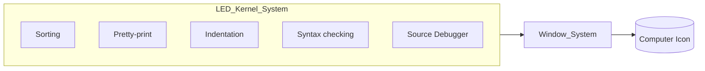

## Page 1

# LED - Language Editor

**ND 211160 LED ND  211159 LED-FORTRAN**  
**ND 211158 LED-PLANC ND  211157 LED-DEBUGGER**

![Photo: Computer with LED software running on the screen]

**ND  
Norsk Data**

_Scanned by Jonny Oddene for Sintran Data © 2010_

---

## Page 2

# LED - Language Editor

## Introduction

The Language EDitor - LED - is a highly effective editor integrated with other program development tools to produce an enhanced programmer environment. The editor is efficiently implemented for the ND-500 and ND-5000 systems. It is integrated with compilers which make it a Syntax Editor, and with debuggers which make it a Source Debugger.

In addition, the user interface is based on a window mechanism where rectangular windows can be easily defined and manipulated. Different source codes and debug information can be viewed and manipulated from the same screen, without leaving the LED editor.

## Features

- Top performance, especially fast response to read and write files. This is due to an advanced but simple implementation.
- Windows are easily defined as multiple non-overlapping or overlapping windows for simultaneous display and editing of several texts.
- Easy to move between windows, to manipulate windows and to move program source text between windows (cut and paste).
- Programming-related functionality and language-dependent modes. Search and substitute follow the language syntax.
- Both forward and backward search. Searching in several texts at a time.
- Advanced cancel possibilities. All changes made in the text can be cancelled by repeatedly pressing the "cancel" key and answering yes/no to whether you wish to restore the original line or not.
- Integrated editor and compiler. For specific languages, all compiler syntax checking is done from the LED editor. The cursor is positioned at the error and allows you to correct mistakes immediately.
- Automatic reading of "include" files in FORTRAN and PLANC.
- Comment headers inserted with a keystroke.

- Integration of the symbolic debugger with LED using the window mechanism.
- Both updated source code and debug information in separate windows on the same screen.
- Set breakpoints and display variables just by pointing in the source code. Execute the program to the breakpoint by pressing a key.
- Display the debug information in one window, while immediately correcting the source code in another window.
- Step by step execution while LED scrolls the source code and pinpoints the currently executed statement.
- All the debug history is stored and can be reread, edited etc.
- Macro facilities.
- Debugging of programs with full-screen output by debugging from an alternative terminal.

---

## Page 3

# LED - LANGUAGE EDITOR

## Product description

The Language EDitor programmer environment consists of several products.

- The central part is the editor with general editing mechanisms. The editor itself includes many language-related features.
- The user interface is through ease-of-use windows.
- A full compiler syntax and semantics check is done from the editor in the integrated editor-compilers.
- The symbolic debugger is fully integrated with the LED editor through the window mechanism.



The architecture of the product family is open for easy inclusion of new features and products.

## Requirements

- ND-5000 or ND-500

## Documentation

| Document          | Reference   |
|-------------------|-------------|
| LED User Manual   | ND-60.266 EN | 

Scanned by Jonny Oddene for Sintran Data © 2010

---

## Page 4

# Corporate Headquarters

**Norsk Data**
Olaf Helsets vei 6  
P.O. Box 25, Bogerud  
Oslo 6  
Norway  
Tel.: +47-2-620000  
Telex: 79673 nd n  
Tlx.: 76615 nd n  
Telefax: +47-2-696148  
New York:  
Telefax: +47-2-267696 (A)

# Norway

Olaf Helset vei 6  
P.O. Box 25, Bogerud  
Oslo 6  
Norway  
Tel.: +47-2-620000  
Telex: 79673 nd n  
Tlx.: 76615 nd n  
Telefax: +47-2-696148  
New York:  
Telefax: +47-2-267696 (A)  

| City       | Telephone      |
|------------|----------------|
| Stavanger  | +47-4-532200   |
| Tromsø     | tel. +47-6-792250 |
| Trondheim  | tel. +47-7-521222  |

# ND Office

**Head Office**
Olaf Helsets vei 6  
P.O. Box 25, Bogerud  
Oslo 6  
Norway  
Tel.: +47-2-620000  
Telex: 79673 nd n  
Tlx.: 76615 nd n  
Telefax: +47-2-696148  
New York:  
Telefax: +47-2-267696 (A)  

# Sweden

**ND Norsk Data AB**  
Kungsvägen 71  
P.O. Box 721  
S-194 27 Upplands Väsby  
Sweden  
Tel.: +46-8-59096000  
Telex: 75196 ndrordta s  
Stockholm, tel. +46-8-7609670  
Malmö, tel. +46-40-760110  
Göteborg, tel. +46-31-467500  

# ND-Silvadata Sweden

S Sv Sundsvall  
S 85180 Sundsvall  
Sweden  
Tel.: +46-60-15150  
Växjö, tel. +46-470-19600  
Stockholm, tel. +46-760-98400  

# Denmark

**Norsk Data A/S**  
Lautrupbjerg 1-3  
P.O. Box 222  
2750 Ballerup  
Denmark  
Tel.: +45-2-658666  
Telex: 25567 ndk d  
Telefax: +45-2-659654 (A)  
Copenhagen, tel. 495-428686/681220  

# Finland

**OY Norske Data AB**  
Puolikkoinenkoulu 2  
02150 Helsinki Finland  
Tel.: +358-0-3452111  
Telefax: +358-0-3656868 (A)  
Oulu, tel. +358-81-372062  

# West Germany

**Norsk Data GmbH**  
Wusteng. Ort 98  
6300 Bad Homburg v.d.H.  
West Germany  
Tel.: 061-7175080  
Frankfurt, tel. +49-69 500000-0  

# The Netherlands

**Norsk Data Nederland B.V.**  
Bosweg 50, 3394 AM Nieuwgein  
The Netherlands  
Tel.: +31-3402 7211  
Telefax: +31-3402 72400  

# France

**Norsk Data s.a.r.l**  
Le Parc des Codeurs  
6 Avenue des Jurtin 01 210 Fernye-Voltaire  
France  
Tel.: +33-802 409678  
Telefax: +33-9853 nordata ferny  

# Switzerland

**Norsk Data (Switzerland) S.A.**  
Chemin du Viaduc 12  
CH-1008 Prilly Lausanne  
Switzerland  
Tel.: 412-25-0252  
Telefax: +41-22-299080  

# United Kingdom

**Norsk Data Ltd.**  
Newbury, Berks RG16 8LU  
United Kingdom  
Tel.: +44-635-305501  
London, tel. +44-1-805-9898  
Manchester, tel. +44-661-905-928080  

# Ireland

**Norsk Data Ireland Ltd.**  
Dublin Industrial Estate, Sentry Avenue  
Dublin 9, Ireland  
Tel.: 353-147 2344  

# USA

**Norsk Data N.A., Inc.**  
Westborough Office Park  
1800 West Park Drive  
Westborough, MA 01581  
USA  
Tel.: +1-617-366-4662  
Los Angeles, tel. +1-712-755-5081  

# France and Italy

**Matra Datavystèmes S.A. Paris**  
Tel.: 33-2-9339 0660  

# Saudi Arabia

**Norsk Data**  
c/o Advanced Systems Ltd.  
Tel.: +5-9661-449821  

# Thailand

**Norsk Data Thai Ltd.**  
Tel. +66-2-2816840  

# Iceland

Tel. +354-1-14131311314  
Tlx.: 0051-92620 oewasy G  

# Asia

| Country     | Contact                         |
|-------------|---------------------------------|
| Pakistan    | Norsk Data Pakistan (P) Ltd.    |
|             | Tel.: 92-51-651546              |
| Saudi Arabia| c/o Advanced Systems Ltd.       |
|             | Tel.: 96-98550-449821           |
| India       | Norsk Data (India) Pvt. Ltd.    |
|             | Tel. 91-44-211155912191216     |
| Hong Kong   | Norsk Data International        |
|             | Tel.: 852-551129/12053          |
| Thailand    | Norsk Data Thai Ltd.            |
|             | Tel. +66-2-2816840              |

# Represented By Agents And Distributors In:

**Norsk Data**   

```
     ___  _    ____ ____ 
    |_|  | |  [_     _ |
    | |  | |__| |    | |
    | |  |_____|_ ]__| |
    |_|@              | 
    | | \____ ^\-__/  |
    | |      \   | | _|
    | |      |   _ ] |  
    | |      |_  | /_\ 
    |_|      /| |   | |
   / _ \     | | |  | |
  | | ' \ ___|-'_|--'
  \_|_|_/   ________,___
```
Scanned by Jonny Oddene for Sintran Data © 2010

---

