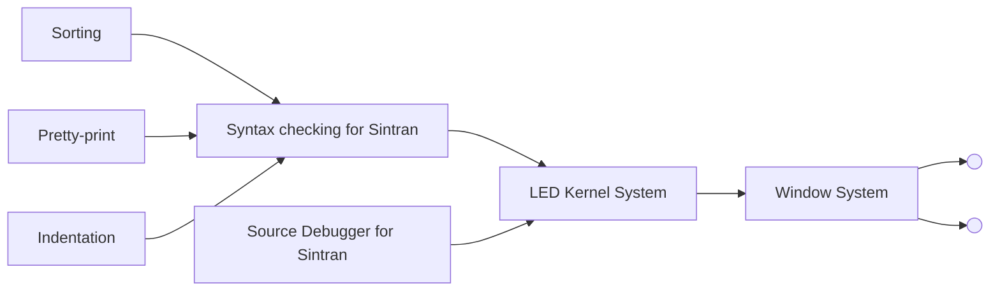

## Page 1

# LED - Language Editor

ND 230050 LED for OWS  
ND 211465 LED for ND-5100/xi  
ND 211157 LED Debugger for ND-500/ND-5000  
ND 211160 LED for ND-500/ND-5000  

[Photo: Computer systems with monitors and keyboard]

---

ND  
Norsk Data

---

*Scanned by Jonny Oddene for Sintran Data © 2010*

---

## Page 2

# LED - Language Editor

## Introduction

The Language Editor - LED - is a highly effective editor integrated with other program development tools to produce an enhanced programmer environment. The editor is efficiently implemented for the ND-5000 and ND-500 systems. It is integrated with compilers which make it a Syntax Editor, and with debuggers which make it a Source Debugger.

In addition, the user interface is based on a window mechanism where rectangular windows can be easily defined and manipulated. Different source codes and debug information can be viewed and manipulated from the same screen, without leaving the LED editor.

## Product Description

The Language Editor programmer environment consists of several products:

- The central part is the editor with general editing mechanisms. The editor itself includes many language-related features.
- The user interface is through ease-of-use windows.
- A full compiler syntax and semantics check is done from the editor in the integrated editor-compilers.
- The symbolic debugger is fully integrated with the LED editor through the window mechanism.



_The architecture of the product family is open for easy inclusion of new features and products._

Scanned by Jonny Oddene for Sintran Data © 2010

---

## Page 3

# LED - Language Editor

## Available on:

| Features                                                                                                     | SINTRAN III | UNIX® | MS-DOS® |
|--------------------------------------------------------------------------------------------------------------|-------------|-------|---------|
| Windows are easily defined as multiple non-overlapping or overlapping windows for simultaneous display and editing of several texts. | ●           | ●     | ●       |
| Windows can be renamed and deleted.                                                                          | ●           | ●     | ●       |
| Several files can be read into different windows with one command.                                           | ●           | ●     | ●       |
| Write all modified files in all windows.                                                                     | ●           | ●     | ●       |
| Easy to move between windows, to manipulate windows and to move program source text between windows (cut and paste). | ●           | ●     | ●       |
| Cursor's position in file in window can be stored and recalled for navigation purposes.                      | ●           | ●     | ●       |
| Compare areas in one or more windows representing one or more files.                                         | ●           | ●     | ●       |
| Programming-related functionality and language-dependent modes. Search and substitute follow the language syntax. | ●           | ●     | ●       |
| Indentation, pretty-print and browsing for C, Fortran, Planc and Pascal.                                     | ●           | ●     | ●       |
| Both forward and backward search. Searching in several texts at a time.                                      | ●           | ●     | ●       |
| Browsing function where lower levels of program structures can be hidden.                                    | ●           | ●     | ●       |
| Advanced cancel possibilities. All changes made in the text can be cancelled by repeatedly pressing the "cancel" key and answering yes/no to whether you wish to restore the original line or not. | ●           | ●     | ●       |
| Cancel allowed for read, write, get-string, get-pattern, substitute and pretty-print operations.             | ●           | ●     | ●       |
| User Programmable Keys to define own editing functions.                                                      | ●           | ●     | ●       |
| For specific languages all compiler syntax checking is done from the LED editor. The cursor is positioned at the error and allows you to correct mistakes immediately. | ●           | ●     | ●       |
| Auxiliary Process Control provides a multi-process environment.                                              | ●           | ●     | ●       |
| Compiler messages mapped into source files.                                                                  | ●           | ●     | ●       |
| Comment headers inserted with a keystroke.                                                                   | ●           | ●     | ●       |
| Top performance, especially fast response to read and write files. This is due to an advanced but simple implementation. | ●           | ●     | ●       |
| Integration of the symbolic debugger with LED using the window mechanism.                                    | ●           | ●     | ●       |
| Both updated source code and debug information in separate windows on the same screen.                       | ●           | ●     | ●       |
| Set breakpoints and display variables just by pointing in the source code. Execute the program to the breakpoint by pressing a key. | ●           | ●     | ●       |
| Display the debug information in one window, while immediately correcting the source code in another window. | ●           | ●     | ●       |
| Step by step execution while LED scrolls the source code and pinpoints the currently executed statement.     | ●           | ●     | ●       |
| All the debug history is stored and can be reread, edited etc.                                               | ●           | ●     | ●       |
| Macro facilities.                                                                                            | ●           | ●     | ●       |
| Debugging of programs with full-screen output by debugging from an alternative terminal.                     | ●           | ●     | ●       |

---

## Page 4

# Requirements

- ND-5000 or ND-500 for ND 211160 and ND 211157
- ND-5100/xi for ND 211465
- OWS-12/55/85 for ND 230050

# Documentation

- LED User Guide  
  ND-860266 EN

---

```
CORPORATE HEADQUARTERS
Tel.: 47-2-626000

NORWAY
Tel.: 47-2-626000

SWEDEN
Tel.: 46-760-98400

DENMARK
Tel.: 45-2-682055

FINLAND
Tel.: 358-0-358811

UNITED KINGDOM
Tel.: 44-635-35544

WEST GERMANY
Tel.: 49-6172-4080

BELGIUM
Tel.: 32-2-7516560

FRANCE
Tel.: 33-1-45371200

IRELAND
If.: 353-1-47244

LUXEMBOURG
Tel.: 352-466176/7/8/9

THE NETHERLANDS
Tel.: 31-34062-72411

SPAIN
Tel.: 34-3-215287

SWITZERLAND
Tel.: 41-21-205012

HONG KONG
Tel.: 852-5-411912/412053

USA
Tel.: 1-617-366-4662

ICELAND
Tel.: 354-1-673711

INDIA
Tel.: 9144-419217/419126

PAKISTAN
Tel.: 92-51-81446

THAILAND
Tel.: 66-2-253-9882/4

ND COMTEC HEADQUARTERS
Tel.: 47-2-626000

ND COMTEC AUSTRIA
Tel.: 43-2266-5353

ND COMTEC USA
Tel.: 1-316-636-5000
```

---

Ⓔ UNIX is a registered trademark of AT & T Bell Laboratories  
Ⓔ MS-DOS is a registered trademark of Microsoft Corporation

---

