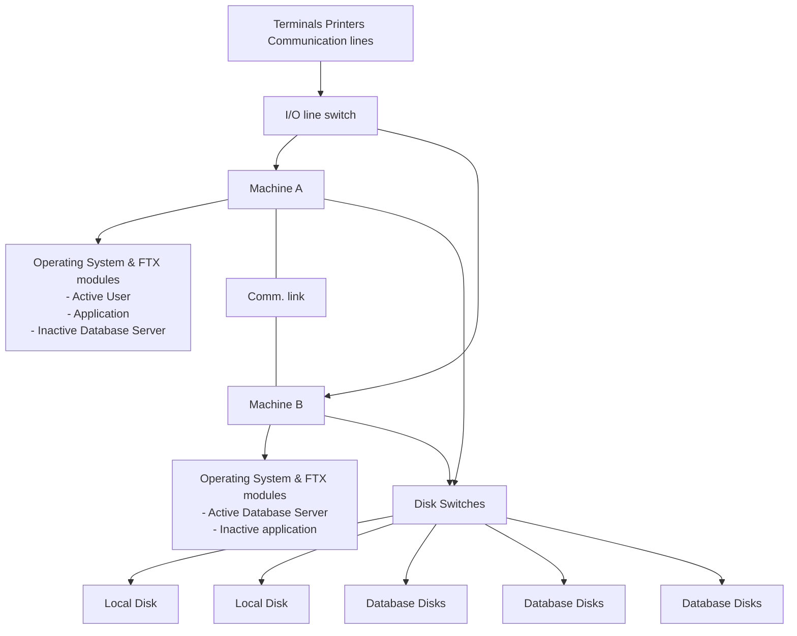
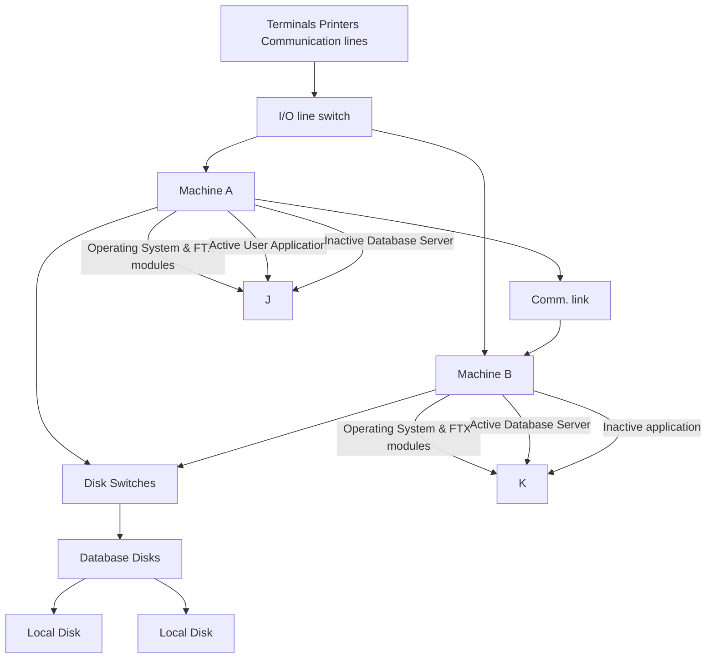

## Page 1

# FTX
## Automatic reconfiguration module

**ND 211168**



```
   ND
Norsk Data
```

[Scanned by Jonny Oddene for Sintran Data © 2010]

---

## Page 2

# FTX

## Introduction

Norsk Data’s FTX system consists of two cooperating ND computers which share mass-storage and I/O devices and are connected together with high-speed communication lines. This system’s main objective is to detect and report errors, to automatically reconfigure hardware and software if necessary, and to bring the database systems and the applications back into operation with a minimum amount of time and data lost.

The Automatic Reconfiguration Module is a part of Norsk Data’s FTX system which provides FTX system reconfiguration facilities without operator intervention. This software module allows the system manager to define procedures that will automatically be started after a failure has been detected in the system. Examples of such procedures are: switching disks, terminals and other I/O devices from the failing system, performing any reconfiguration necessary on the cooperating system, initiating recovery and restart of databases and preparing the applications for start-up.

## Features

- Full utilisation of the stand-by processor. Workload can be shared between the two processors in normal operation.
- High availability. The system continues operation even if there is a single failure in a critical component.
- There are no special programming requirements on user applications; the same requirements apply as on non-FTX systems.
- Automatic reconfiguration of hardware and software after failure. All operational procedures for system recovery and reconfiguration can be defined in advance and there will be no need for an operator to monitor the system.

## Product Description

### FTX System

In Norsk Data’s fault tolerant system, FTX, two coordinated ND systems are interconnected via high-speed communication lines and share mass-storage devices and peripherals. The machines have their own separate memories, and run different copies of the operating system.

Each machine supervises the other to see that it operates properly or if it is necessary to take over the whole operation - at reduced performance - until the faulty unit has been replaced. Critical data is stored simultaneously on mirrored (parallel) disks. The disks are connected through a dual-ported switch and can be operated from either one of the two machines.

Peripherals and external communication lines can be switched from the failing machine to the active one. The workload may be distributed so that the two machines share the total application/database load, or they may handle independent applications such as text processing on one machine and transaction processing on the other.

The possibility of distributing the workload between the two machines increases performance compared to more traditional fault tolerance hot/cold standby solutions where the second machine cannot take on part of the normal operation.

## Automatic Reconfiguration Module

The FTX Automatic Reconfiguration Module contains three sub-modules that survey the status of the two machines in an FTX configuration (System Surveyor): decide on the type of action to be taken in case of failure (Decision Maker); and recover and reconfigure the system (Recovery and Reconfiguration Module).

The surveying procedure is a high-priority task in an FTX configuration, which continually exchanges status messages and receives similar messages from the cooperating system. Should one of the expected messages not arrive within the allotted timeframe, the Surveyor informs the Decision Maker of the suspected failure.

The Decision Maker Module, invoked by the Surveyor or other system modules, initializes predefined commands and procedures according to the type of message received by the Surveyor. One of the procedures may be to initiate total reconfiguration of the system, including database recovery, should that be necessary.

The Recovery and Reconfiguration Module makes it possible to define a set of operational procedures to be invoked if required. The user may store commands or names of programs in a file, which will automatically be activated through the Decision Maker Module.

In this way a predefined and controlled set of procedures can be planned ahead and stored as a fixed setup of the computer operation. This will save valuable time when most needed.

Recovery in this context means to restart one of the cooperating machines after a fault has been repaired, or scheduled service has been performed. Reconfiguration means the actions necessary to continue operation if a situation occurs where one machine goes down or is temporarily taken out of operation.

The reconfiguration part mainly consists of initiating database recovery (the actual recovery procedure is handled by the SIBAS database management system), disk and I/O line switching and possibly application restart.

The following figure illustrates the software modules in the FTX configuration:

```mermaid
flowchart TD
    A[Disk Mirroring]
    B[System Surveyor "I'm Alive"]
    C[Error Logging]
    D[Decision Maker]
    E[Recovery and Reconfiguration]
    F[User Programs]
    G[FTX Manager Programs]
    H[Cooperating FTX System]
    I[I/O Switch]
    J[Disk Switch]
    K[DBMS Restart]
    L[Appl. Restart]
    
    A --> D
    B --> D
    C --> D
    D --> E
    E --> I
    E --> J
    E --> K
    E --> L
    H --> I
    H --> J
    H --> K
    H --> L
```

*The Disk Mirroring Software is a prerequisite for the FTX System.

[Diagram: FTX Automatic Reconfiguration structure with modules]

---

## Page 3

# FTX

## Operation example

The following illustration shows a typical FTX configuration:



## Prerequisites

- FTX system package. This is a duplicated system with communication lines and has facilities for disk mirroring and disk switching.
- Megalink. In order to run the Automatic Reconfiguration Module, the two systems in the FTX configuration should have a double communication line. Since the basic configuration of the FTX systems only includes a single communication line, at least two Megalinks must be installed in each machine.
- SINTRAN III/VSX version K, workmode 500 or later.

## Documentation

ND FTX Configuration Management Guide.......ND-30.069

In the illustration above, the workload is distributed between machines A and B. Machine A runs the application programs while machine B runs the database management software.

In this case, the terminals are connected to machine A, whereas the data disks are connected to machine B. To provide full redundancy, machine A includes a copy of the database software and machine B holds a copy of the application programs.

Each machine contains the FTX Automatic Reconfiguration software which, as described above, detects a failure situation in one of the machines and initiates the necessary reconfiguration process.

The reconfiguration process performs tasks like switching the I/O lines (using the I/O lines switch), switching the database disks (using the disk switch), initiating database recovery (done by the database management software) and reconfiguring and possibly restarting the applications.

The FTX system does not restrict the type of application that is performed on each machine. The customer may choose to share total system load by running applications in one machine and the SIBAS backend database in the other, or to run all the transaction processing in one, and for instance ND-NOTIS Office Support systems in the other.

---

## Page 4

# Norsk Data Contacts

## Corporate Headquarters

**Of Helsetes vei 5**  
P.O. Box 50, Bogerud  
N-0611 Oslo 6  
Norway  
Tel.: +47-2-620000  
Telex: 79628 nd n

## Norway

**Of Helsetes vei 6**  
P.O. Box 70, Bogerud  
N-0611 Oslo 6  
Tel.: +47-2-620000  
Telex: 78128 n d no

## ND Committe

**Of Helsetes vei 6**  
P.O. Box 50, Bogerud  
N-0611 Oslo 6

## Sweden

**ND-Silvadata AB**  
S-851 43 Sundsvall  
Tel.: +46-060-15150  

## Denmark

**Norsk Data A/S**  
Lautrupbjerg 1-3  
P.O. Box 144  
DK-2750 Ballerup  
Tel.: +45-2-864065  

## Finland

**Oy Norsk Data Ab**  
Pitkamenkatu 2  
SF-00271 Helsinki  
Tel.: +358-0-5362884

## United Kingdom

**Norsk Data Ltd.**  
Banbury, England  
OX16 1DN  
Tel.: +44-295-35996

## West Germany

**Norsk Data GmbH**  
Thorstensweg 10-12  
D-2060 Hamburg 60  
Tel.: +49-40-6712200  

## Belgium

**Wordplex Belgium S.A.**  
Excelsiorlaan 25  
B-1930 Brussels 15  
Tel.: 02-7251551  

## France

**Norsk Data Paris**  
2, Rue Gorges Demrose  
F-92240 Malakoff  
Tel.: +33-1-46440400  

## Ireland

**Norsk Data Ireland Ltd.**  
IDA Industrial Estate, Santry Avenue  
Dublin 9  
Tel.: +353-48-2761  

## Luxembourg

**Wordplex Luxembourg**  
Rue de l’Industrie No.5  
1811 Luxembourg  
Tel.: +352-482578  

## The Netherlands

**Norsk Data Nederland B.V.**  
P.O. Box 500  
NL-3800 AM, Nieuwegein  
Tel.: +31-3402-70400  

## Spain

**Norsk Data - Wordplex España S.A.**  
Passeig de Gracia 50  
E-08007 Barcelona 50  
Tel.: +34-1-9022925  

## Switzerland

**Norsk Data (Switzerland) S.A.**  
Chemin du Prévu 12  
CH-1018 Lausanne  
Tel.: +41-21-653202

## Australia

**Wordplex Australia Pty. Ltd.**  
Unit 8, 5 Skyline Place  
Frenchs Forest (Sydney)  
Tel.: +61-2-9732300  

## Hong Kong

**Norsk Data International**  
1102 Wing On Central  
111 Connaught Road  
Hong Kong  
Tel.: 852-5-911292

## USA

**Norsk Data N.A., Inc.**  
Westborough Office Park  
1800 West Park Drive, Suite 150  
Westborough, Massachusetts 01581  
Tel.: +1-617-366-3866  

## Iceland

**Norsk Data Iceland**  
Tel.: +354-1-676291  

## India

**Norsk Data India Pty. Ltd.**  
Tel.: +91-462719126  

## Pakistan

**Norsk Data Pakistan (P) Ltd.**  
Tel.: +92-51-925186  

## Thailand

**Norsk Data Thailand Ltd.**  
42 Complex, 286 8th fl.  
Tel.: +662-253-9864  

---

```
               /\
              /--\
             /----\
            /------\
           /--------\
          /----------\
```

---

