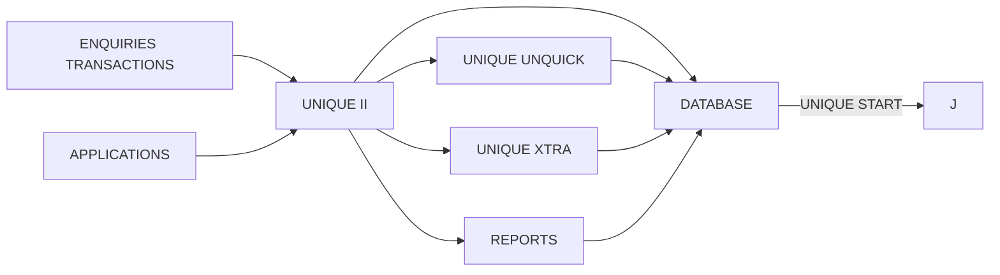

## Page 1

# UNIQUE Application Development

**DIALOGUE-1 for ND-100/110 ND 211202**  
**DIALOGUE-1 for ND-500/5000 ND 211203**




Scanned by Jonny Oddene for Sintran Data © 2010

---

## Page 2

# UNIQUE Application Development

## Introduction

DIALOGUE-1 UNIQUE Applications Development Package is a set of fourth-generation tools for development of administrative data processing applications, comprising:

- UNIQUE START for database definition
- UNIQUE UNIQUICK to define screen forms and data usage
- UNIQUE II for procedure definition
- UNIQUE XTRA for reports and queries
- UNIQUE DOCUMENTATION for system documentation

DIALOGUE-1 may be run both on ND-100/110 and on ND-500/5000 systems. It is available as an application development system, as well as in runtime versions for operation. UNIQUE UNIQUICK and UNIQUE II are also available in versions for ISAM (indexed sequential) files.

DIALOGUE-1 is a comprehensive set of functions for interactive information systems. The UNIQUE approach is to design screen forms first, and subsequently to define the functions that relate the display fields to the database. UNIQUE is also ideal for prototyping and experimental system development. Such models are quickly defined, user participation is encouraged, and programming efficiency is radically improved, and subsequent maintenance costs are reduced.

Terminal function-keys are used in accordance with DIALOGUE/NOTIS standards. The UNIQUE system is offered in several language versions.

## UNIQUE UNIQUICK

UNIQUE UNIQUICK is the DIALOGUE-1 application generator. It is used to design screen forms, for subsequent processing with UNIQUE II.

UNIQUICK is user oriented, with extensive selection from menus. When used with SIBAS, DIALOGUE’s database management system, these menus are automatically set up from data-dictionary information.

The normal design procedure is to:

- Select one or more databases
- Select one or more tables
- Select columns from these tables to display in the screen form
- Additional fields may be defined for calculation and work areas
- Specify processing rules to apply to the fields

The form may be edited to fit specific format requirements, and ND-NOTIS graphics (S-format) may be used to include boxes or special symbols. The completed transaction form may be used for entering, updating, and retrieving data in the database with UNIQUE II.

The SIBAS version of UNIQUE UNIQUICK is provided as part of DIALOGUE-1. It may also be ordered separately in SIBAS or ISAM versions. The corresponding version of UNIQUE II is a prerequisite.

## UNIQUE II

UNIQUE II is a multiuser system for online database processing.

UNIQUE II includes functions for retrieving, storing, modifying and deleting data, while performing the desired processing. Database tables are accessed by means of one or more keys. Any one of these keys may be used for rapid querying and browsing - first, next, previous or last line.

The DIALOGUE version also provides functions for including text information as part of a database table. Graphic presentation of data histograms is available on standard terminals. IF statements and jumps facilitate conditional processing.

Standard functions comprise:

- Enter, enquire, or list selected data
- Perform arithmetic on this data – compute, accumulate
- Enter text using NOTIS-WP and returning to the data form context
- Calendar – date, week, clock
- Send/receive messages
- Select data by means of database keys – unique or 'alternative', – and 'join-key' to link data tables
- Specify default-value and initial-value for screen data fields
- Validate data for legal value – in database or program table
- Sequence controls – routing (between screen fields), lock

‘Special’ program subroutines may be called to process specific sequences in COBOL, FORTRAN, or PLANC.

A user-menu environment may be designed, including 'help' information, to select application, and start other systems, – which may include other parts of the DIALOGUE and NOTIS ranges. The log-on procedure is integrated with the standard UE (user environment), and TRUE may be used for database recovery control.

Example: A simple application is required to maintain a customer register (CUSTOMER) in the database ORDDBASE. The application design has two parts, a form layout and a forms description.

The screen form layout consists of texts and fields. It may be generated by UNIQUE UNIQUICK, and/or edited manually. If the form is designed interactively, each field is positioned by means of the `°` character. Here is how the final form may appear on the screen:

```
Start-form               CUSTOMER
---------------------------------------------------
Number                     Name                     Shortname
°°°°°°                       °°°°°°                      °°°°°°
°°°°°°                       °°°°°°                      °°°°°°
°°°°°°                       °°°°°°                      °°°°°°
°°°°°°                       °°°°°°                      °°°°°°
Contact Person                        Telephone              Payment
End-form
---------------------------------------------------
```

---

## Page 3

# UNIQUE Application Development

This is directly followed by the forms description, listing the column-names in the same sequence as drawn in the form, to map the form onto the database. Database keys, processing functions, and relations between fields are also given in this description. 

The DIALOGUE version of UNIQUE will fetch the rest of the data descriptions, type, length, and display format (indicated with ... on the form), from the data dictionary. For the form above, the description might be:

```
start-fields
database-name = ORDRBASE
table-name = CUSTOMER
field-name = "CUSTOM" key
field-name = "NAME" letter-type(UPPER) alternative-key
field-name = "SHORTNM" letter-type(UPPER) alternative-key
field-name = "ADDRESS1"
field-name = "ADDRESS2"
field-name = "ADDRESS3"
field-name = "TELNO"
field-name = "CONTPERS" letter-type(UPPER) alternative-key
field-name = "PAYCONID"
end-fields
```

Even these simple specifications are largely generated automatically if UNIQUICK is used.

The SIBAS version of UNIQUE II is provided as part of DIALOGUE-1. It may also be ordered separately in SIBAS or ISAM versions.

Three additional functions are included in the DIALOGUE-1 package. They are also provided in a separate UNIQUE Upgrade:

## UNIQUE Upgrade

### UNIQUE START

Database definition is made easy with UNIQUE START. The definition includes data elements, i.e. tables, columns, field names, default display heading, and purpose (description). It also comprises structure, that is selection of fields to be used as keys, and set relations between tables.

UNIQUE START uses an interactive, guided approach. Data types and logical constraints (legal values) may be globally defined to further encourage standardisation, and ensure consistency. Default and/or initial field values may be preset.

UNIQUE START is part of the DIALOGUE-1 package, and available to users who already have UNIQUE/UNIQUICK, with UNIQUE Upgrade.

### UNIQUE XTRA

XTRA is a reporting tool for DIALOGUE and ISAM data, to make extracts that may be presented as simple lists or formatted reports.

XTRA is menu and function-key driven, with emphasis on user friendliness. XTRA uses the SIBAS dictionary for definition of formats and storage types.

The user selects

- database(s)
- table(s)
- columns (fields) from the table(s)
  
While reporting, XTRA can

- update or delete rows in the database table
- process data by counting, summing, sorting etc.
- select by means of IF-conditions, inquiry values etc.

The finished report is automatically formatted, and may optionally be edited further with NOTIS-WP. The report definition may be stored in a separate or a common library file.

UNIQUE XTRA is part of the DIALOGUE-1 package, and available to users who already have UNIQUE/UNIQUICK, with UNIQUE Upgrade.

## UNIQUE Documentation

This function produces system documentation and user documentation, i.e. user handbook, database documentation, cross-reference lists of fields for maintenance etc.

UNIQUE DOCUMENTATION is part of the DIALOGUE-1 package, and available to users who already have UNIQUE/UNIQUICK, with UNIQUE Upgrade.

## Product Specifications

| Product Description                                                   | Product Code |
|----------------------------------------------------------------------|--------------|
| DIALOGUE-1 for ND-100/110 consisting of ND 210729, ND 210871, and ND 211400 | ND 211202    |
| DIALOGUE-1 for ND-500/5000 consisting of ND 210730, ND 210872, and ND 211401 | ND 211203    |
| DIALOGUE-1 Runtime for ND-100/110                                    | ND 211204    |
| DIALOGUE-1 Runtime for ND-500/5000                                    | ND 211205    |
| UNIQUE Upgrade for ND-100/110                                         | ND 211400    |
| UNIQUE Upgrade for ND-500/5000                                        | ND 211401    |
| UNIQUE II SIBAS for ND 100/110                                        | ND 210729    |
| UNIQUE II SIBAS for ND 500/5000                                       | ND 210730    |
| UNIQUE UNIQUICK SIBAS for ND-100/110                                  | ND 210871    |
| UNIQUE UNIQUICK SIBAS for ND-500/5000                                 | ND 210872    |
| UNIQUE II SIBAS Runtime for ND 100/110                                | ND 211083    |
| UNIQUE II SIBAS Runtime for ND 500/5000                               | ND 211084    |
| UNIQUE II ISAM for ND-100/110                                         | ND 210731    |
| UNIQUE II ISAM for ND-500/5000                                        | ND 210856    |
| UNIQUE UNIQUICK ISAM for ND-100/110                                   | ND 210869    |
| UNIQUE UNIQUICK ISAM for ND-500/5000                                  | ND 210897    |

Scanned by Jonny Oddene for Sintran Data © 2010

---

## Page 4

# Requirements

- **SINTRAN** Operating System
- **SIBAS-L** SIBAS/RE Database Management System (or ISAM)
- UNIQUE IL is a prerequisite for UNIQUE UNIQUICK
- UNIQUE IL and UNIQUE UNIQUICK (SIBAS version) are prerequisites for UNIQUE Upgrade

# Documentation

- UNIQUE UNIQUICK User Guide (English or Norwegian) ND-60.240
- UNIQUE IL User Guide ND-60.250
- UNIQUE Application Development ND-60.260
- Programming Examples ND-60.210

# Contact Information

## Corporate Headquarters

**Olaf Helsets vei 6**  
P.O. Box 25, Bogerud  
0612 Oslo 6  
Norway  
Tel.: +47-2-620000  
Telex: 10656 nd n  
Tlx.: +47-2-694349  
Telex: 4722 nd n  
New York: +47-2-726219

## Norway

- Oslo, tel: 47-2-620000  
- Bergen, tel: 47-5-243000  
- Sandnes, tel: 47-4-552300  
- Trondheim, tel: 47-7-916222

## ND-UK

- Olaf Helsets vei 6  
- P.O. Box 25, Bogerud  
- Oslo 6  
- Norway  
Tel.: +47-2-620000  
Tlx.: 10656 nd n  

## Sweden

- **ND-Sweden A/B Applikon**  
  Västberga Allé 11  
  12615 Stockholm  
  Tel.: +46-8-7609800  
  Tlx.: 51415

# Other Countries

| Country           | Details                                                                                       |
|-------------------|-----------------------------------------------------------------------------------------------|
| **Denmark**       | OY Norsk Data A/B <br> Laurruphey 13 <br> P.O. Box 22 <br> 2790 Barca Up <br> Tel.: 45-2-668656 |
| **Finland**       | OY Norsk Data A/B <br> Pukirikvadenko 2 <br> 0217 Helsinki Finland <br> Tel.: 358-0-56908 |
| **Germany**       | Norsk Data GmbH <br> Homburger Hof <br> 6300 Bad Homburg V.d.H. <br> Tel.: 06172-75000 |
| **Netherlands**   | Norsk Data Nederland B.V. <br> 1023 AM Nieuwegein <br> P.O. Box 50, 3430 AM Nieuwegein <br> Tel.: 31-3402-72400 |
| **France**        | Norsk Data s.a.r.l. <br> Avenue du Jura, 210 Ferney-Voltaire <br> Tel.: 33-50406566 |
| **Switzerland**   | Norsk Data (Switzerland) S.A <br> Chemin du Viaduc 12 <br> CH-1008 Lausanne <br> Tel.: 41-21-212502 |
| **United Kingdom**| Norsk Data Ltd <br> Newbury, Berks RG16 8LU <br> WestCentralDes <br> Tel.: 44-635-3995 |
| **Ireland**       | IDA Industrial Estate, Sentry Avenue <br> Dublin 8 Ireland <br> Tel.: 353-1-4244 |
| **USA**           | Westborough Office Park <br> 1800 West Park Drive <br> Tel.: 617-366-4662 |
| **India**         | Norsk Data (India) Pvt. Ltd. <br> Tel.: 0802-5546 nd id |
| **Pakistan**      | Norsk Data Pakistan (P) Ltd. <br> Tel.: 92-2661-5146 |
| **Saudi Arabia**  | Norsk Data <br> Tel.: 966-49475229021<sup>(A)</sup> |
| **Thailand**      | Norsk Data Thailand Ltd. <br> Tel.: 662-2236846 |

# Additional Information

- **Iceland**
  - Tel.: 354-1-1413/11314
- **Italy/France**
  - Télémathique S.A. Paris <br> Tel.: 33-31890530
- **Hong Kong**
  - Norsk Data International <br> Tel.: 852-5119647

```plaintext
        _
  _ __ (_) ___     _ __   ___  _   _    __ _  __  _
 | '_ \| |/ _ \   | '_ \ / _ \| | | |  / _` | \ \/ /
 | | | | | (_) |  | | | | (_) | |_| | | (_| |  >  <
 |_| |_|_|\___/   |_| |_|\___/ \__,_|  \__,_| /_/\_\
```

---

