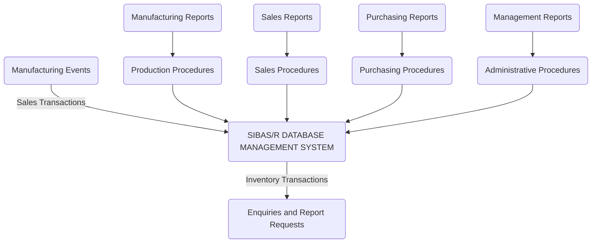
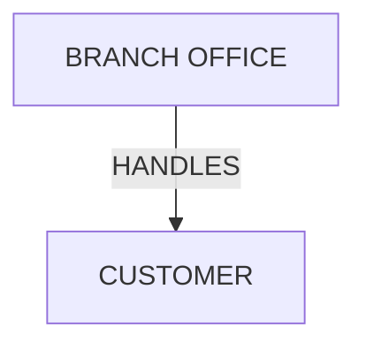
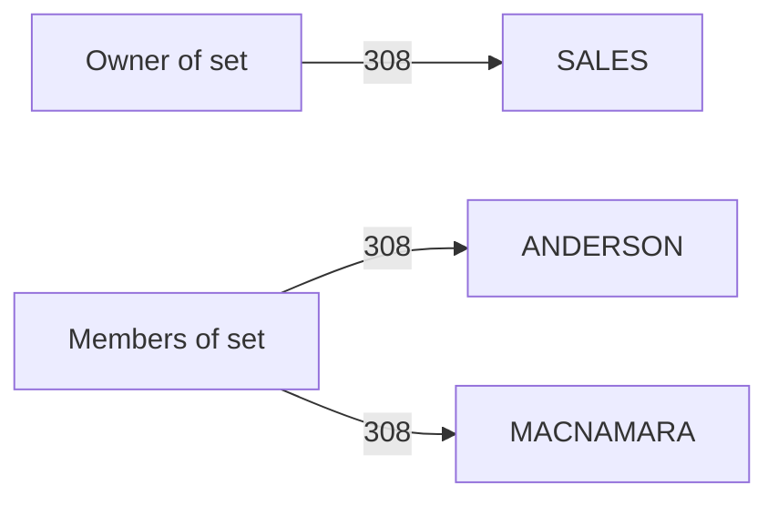
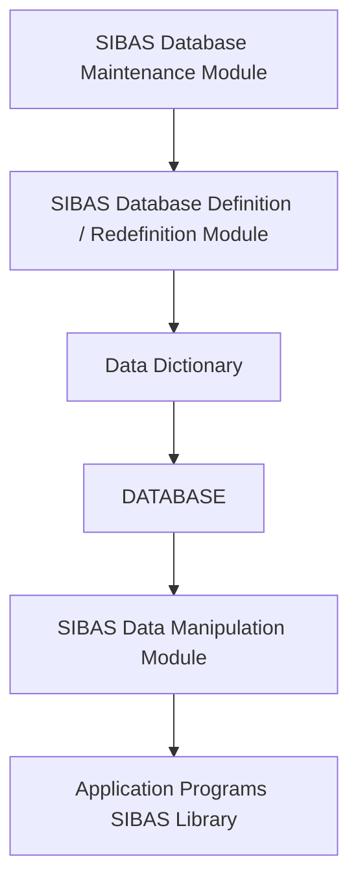

## Page 1

# SIBAS/R — Data Management

ND 2111212 SIBAS/R for ND-500/ND-5000  
ND 211146 SIBAS/R Runtime for ND-500/ND-5000  
ND 211201 SIBAS/R Link for ND-100/ND-500/ND-5000  
ND 211304 SIBAS/R Library for ND-100/ND-500/ND-5000  
ND 230030 SIBAS/R Library for OWS  
ND 211404 SIBAS/R Backend for ND-500/ND-5000  

```
    BUSINESS
  TRANSACTIONS
       ↘ 
     _________
    |         |
    | DATABASE|
    |_________|
       ↘
INFORMATION
  SYSTEMS
```

```
ND
Norsk Data
```

---

## Page 2

# SIBAS/R — Data Management

## Introduction

SIBAS/R is a relational data management system, also including facilities for supporting network structures. It is designed to handle the data storage and retrieval requirements of a constantly changing environment. Common data is structured and managed in an independent information resource to be drawn upon by the whole community of users.

SIBAS/R consists of the following parts:

- SIBAS/R database management system
- SIBAS/R Backend, an extension to allow remote database access
- SIBAS/R Library, an extension to allow front-end applications to access a remote SIBAS/R database via a local and/or public data network

Additionally, the database can be manipulated with the query languages ND-SQL interactive and ACCESS.

Remote access from applications which do not have SIBAS/R in their local system requires:

- SIBAS/R Library, application library for database access from remote ND computers and MS-DOS-based Office Workstations

SIBAS/R allows application programs to share common data and data descriptions, and offers multiple users concurrent access to the same database in a controlled and secure manner.

## Features

- Supports concurrent local and remote access to multiple databases from any combination of MS-DOS Office Workstation and ND server applications
- Supports simultaneous relational access through SQL as well as DML access to the same information
- Transparent linking of local and remote databases via a COSMOS wide area network (WAN) and/or a COSMOS local area network (LAN)
- Online-oriented multiuser access
- Integrated data dictionary supporting interactive queries and automatic program generation
- High-performance features supporting multiuser and multiprocessing operation
- Flexible integration of text and formatted data
- Controlled expansion of the database applications via restructuring facilities, and by the SAFE (Systems Architecture for Expansion) modularity offered by ND systems
- High level of data integrity, fail-safe features
- Optional automatic operation

## SIBAS/R supports the integration of applications by offering

- Flexible database structuring supporting relational access through SQL as well as network access methods
- Many possible access paths to and through the database
- Preservation of database integrity in a concurrent processing environment, fail-safe features
- Control over unauthorized access to data
- Data independence - the ability to extend and modify the structure without affecting application programs
- Available from high-level programming languages and 4th-generation application tools

Additionally, the data is made available for administrative queries and information systems on a regular or occasional basis, through query languages and report writers:



The dictionary, integral to DIALOGUE operation, is the key to this simplicity. It supplies consistent descriptions of shared data to applications, making it simple to add features as well as to retrieve data on request. Databases may be distributed among multiple systems in order to take into account both corporate and individual requirements.

---

## Page 3

# SIBAS/R — Data Management

## Product Description

### SIBAS/R — Dictionary Service and Database Design

SIBAS/R is the core of DIALOGUE information tools:
- UNIQUE! On-line for Office Workstation
- DIALOGUE-1, UNIQUE Application Development
- DIALOGUE-2, IBM 4th-Generation System
- DIALOGUE-3, BEM Application Building and Maintenance
- ACCESS and SQL, interactive data retrieval
- RG, report generator

Descriptions of each database are provided through SIBAS itself, and additional system functions supply a directory of all databases. All data users, i.e. applications, report generator, query systems etc., can therefore access data at a logical level, by database name and table name.

The dictionary information includes descriptions of all data items, such as type (storage format) and length. It can also contain a description of the information content, i.e. the purpose of the data, and default values for display formats and names ("heading"). This information is used in automatic program generation and documentation and to simplify the use of data in reports and queries. Objectives are:
- data consistency: avoid redundancy, ensure coordination
- common definition for all data manipulation
- increased productivity in system development: reduce effort
- increased productivity at user level: enhance information value

SIBAS/R includes a data definition language. The definition of a database is called a schema, and includes descriptions of the storage files, tables and physical access structure. The data definition language gives system tuning possibilities like defining optimal page-size, storing the same logical table on several disks for faster access, tuning the balancing of index b-trees, etc. This definition is made transparent to the database designer, through the DIALOGUE application development systems.

The first step in designing a database is always to identify the basic tables which will make up the database. For instance, in a typical marketing company, the following six tables might be identified as necessary:
- Customer
- Product
- Branch office
- Supplier
- Sales order
- Purchase order

The database definition will then include a _table_ for each of the above, each _row_ in the table representing one record. Related rows in different tables can be retrieved by means of relational operations. The process may be supported by a connecting structure, defined by means of _sets_, using _keys_ and _indexes_.

### SIBAS/R — Structuring Concepts

SIBAS/R refers to all data in terms of tables, consisting of rows. Each row consists of fields, repeated identically through all rows, so that the table also displays a column structure.

```
+---+---+---+
| C |   |   |
| O |   |   |
| L |   |   |
| U |   |   |
| M |   |   |
| N |   |   |
+---+---+---+
| R |   |   |
| O |   |   |
| W |   |   |
+---+---+---+
```

SIBAS/R recognises the relational, i.e. table-oriented, way of referencing data. This access method offers a very flexible way of defining precise subsets of data. There are two reasons for this:
- the definition is deferred until the data is required, at which point a dynamic selection is made
- the selection is not limited by the physical storage structure of the database

---

## Page 4

# SIBAS/R — Data Management

## Location Modes

Table rows in a SIBAS/R database are stored in disk pages. Disk page size is user-defined. Each disk page contains one or more table rows. Table rows are stored on disk pages in serial or hash/calc location mode.

Serial storage means that each row is stored in the first disk page having a free table row location.

Hash/calc location means that each table row's position is computed by giving a table column value as input to hashing algorithm. Output from the hashing algorithm is the table disk page number. If the disk page space is exhausted, the table row is stored in an overflow area. Primary and overflow area pages are linked by pointers from the primary to the overflow area. Each hash/calc table can and must have one hash/calc key only. The hash/calc table column may consist of one or more table columns (group column), and whether the hash/calc key is unique or non-unique is defined at hash/calc key definition time.

## Keyword Index

When an index is defined on a column containing alphanumeric data, SIBAS/R supports the use of a multiple key. This is accomplished by entering two or more keywords in the column (or group column). SIBAS/R will prepare an index to the row for each such keyword. Subsequently, the data may be accessed via either keyword, for instance to retrieve a person by first name or surname, or to find a library item under several topics (document abstract).

## Set Types

SIBAS/R supports referential integrity through defining how columns relate to each other. A column can relate to a column within the same table, to a column in another table or to columns in multiple tables. In the following figure, the table BRANCH OFFICE is identified as the reference table, and the other table is the referring table.



Each of the rows in the table BRANCH OFFICE may be linked to CUSTOMER rows, which in turn have a foreign key referring to a BRANCH OFFICE. The set concept ensures referential integrity, i.e. that a BRANCH OFFICE will always exist for each CUSTOMER (unless the column value is zero indicating that the link has not been established).

Multi-member sets may be established with two or more member tables connected to each owner.

Furthermore, SIBAS/R supports involuted sets, meaning that there is a relationship between a table and itself. An example could be a bill of material application where parts are made up of other parts. This is illustrated as follows:

```
  _________
 |         |
 |  PARTS  |
 |_________| 
     |      
     | USES
     v
  _________
 |_________| 
```

## Indexes

Indexes can be defined on both serial and hash/calc tables. The user may define one or more columns to be used as indexes. Each index may correspond to a single column or group of columns in the table. For each index, a corresponding index table is built, which may be automatically maintained by the system when the database is updated. An index may be designated as either permitting or prohibiting duplicate values in the index column.

The example below shows two tables using calc keys and additional indexes. A branch could be retrieved by BRANCH NUMBER or TOWN, customers by CUSTOMER CODE, NAME or ADDRESS. The advantage of referencing by index is the automatic sequencing (sorting), while calculated pointers can provide faster access.

```
Calc key         Index
+---------------------+
|  BRANCH NO.  TOWN   |
+---------------------+
|         BRANCH TABLE|
-----------------------
```

```
Calc key         Index       Index
+-------------------------------+
| CUSTOMER   NAME     ADDRESS  |
|  CODE                STREET   |
+-------------------------------+
|        CUSTOMER TABLE        |
--------------------------------
```

Indexes are always stored as a "balanced tree".

---

## Page 5

# SIBAS/R — Data Management

## Text and Images

Columns of arbitrary width and content may be included. This feature permits flexible processing of text and structured data in the same context. The contents may, however, equally well represent a recorded video image, a spoken message etc.

## SIBAS/R Data Manipulation Facilities

The flexibility for structuring a SIBAS/R database is matched by the facilities provided for processing the data in the database.

The information in a database can be manipulated from local and remote applications alike. Remote applications can run on another ND server or in an ND Office Workstation under the MS-DOS operating system.

Access to a SIBAS/R database can be sequential, direct or relative. Access to the first data row in a logical processing sequence may be direct. Whether the direct access utilizes an index or the HASH algorithm is transparent to the application program.

### Direct Access

Direct access requires the user to provide the value of a key item in a specific column within the table to be referenced. If there are several rows in the table with the same key value, the first of these is retrieved. The user can subsequently access the others using a relative access.

### Relative Access

Relative access is used to locate a row relative to a row already found. The types of relative access are:

- row with the same value in the index column as the one already found
- row with the same (or next higher or next lower) value in the index column, within a given interval, located via index
- all rows in a physical table in ascending or descending order with respect to the value of the access key
- all rows in a physical table in serial order
- access via relations

### Access via Set

A set is a chain of rows, called members. The entire chain is linked to one other row (usually in another table), called the owner.



Examples of sets are employees in a department structure, or items in a purchase order. Special cases, such as products built from parts consisting of other parts, are also handled (see involuted sets).

By following the pointer links, members of a set may be processed relative to another set member, optionally also in "backward" order, i.e. prior or next:

- set member relative to set owner
- set member relative to another set member
- set owner relative to a set member

The set concept supports extremely efficient use of foreign keys.

## SIBAS/R — Operation

### Concurrent Processing

In SIBAS/R, several programs may process the same database concurrently. The word "program" is adopted in the narrow sense, recognising that the same program may be executed by several users simultaneously with different parameter values. Each "executing instance" is recognised as a separate program.

This allows for levels of protection:

- database reservation, locking out all other programs
- table reservation
- row lock
- extended monitor mode

A table may be reserved for

- retrieval
- load
- update

with an additional option to reserve for

- exclusive update

If the latter option is not used, a single row or group of rows may be locked instead.

The least restrictive protection is to invoke "extended monitor mode", where the protected program is notified if another concurrent program modifies any part of the protected data.

---

## Page 6

# SIBAS/R — Data Management

## Privacy

SIBAS/R supports row privacy locks, by allowing a table column to be identified as a privacy lock. To retrieve the row, the user must first give the correct value of the corresponding lock field. This simple device provides the customer with an effective control over the access to individual rows.

```
SECRET  ITEM  ITEM
 __________________
|                  |
|                  |
|__________________|
```

## Restructuring

A database may be restructured by adding or deleting any of the following:

- Columns in existing tables
- Table types
- Set types
- Indexes

Care must be taken to ensure that all users of the data are in agreement with the changes. The dictionary is of great assistance in this process, since it will always reflect the current structure.

The ability to restructure a database is of particular importance when:

- New applications require new data or new structuring of existing data
- Existing data and data structures become obsolete
- The amount of data to be stored in the database grows larger than anticipated, leading to low performance and poor economy

The advantages to the user are obvious: the restructuring facility simplifies the task of designing the original database, as its development can be done in steps, since it is not necessary to take all possible future requirements into consideration. The structure can be optimized for performance reasons without affecting applications, and without requiring reloading of the old data.

## Routine Logging

The routine log is a sequential file where application calls to SIBAS/R are recorded before they are processed. Routine logging is an option which may be selected in the start-up procedure of SIBAS/R, providing a simple and robust reprocessing mechanism.

When routine logging is on, this log file can be used to recreate the database by reprocessing it against the database from the most recent checkpoint. This checkpoint may be reinstated either by using the "before image" log to reset ("roll back") the current database, or by reloading a backup copy.

## Before-Image Logging

Before-image logging should always be turned on during normal operation. The before-image log will contain a copy of all changed pages, with their appearance before the change, thus allowing the database to be reset to a previous, consistent checkpoint.

- SIBAS/R will automatically perform database resetting ("roll-back") after an unscheduled stop.
- The current transaction can also be cancelled by the application, without interference with concurrently executing programs. This facility requires the use of the before-image log, and allows a choice of either committing or canceling each transaction result. The transaction monitor TRUE may be used to control this, in case the application program is terminated abnormally.

## Checkpoints

Checkpoints are taken automatically when the database is closed physically, i.e., when the last program closes the database. In addition, checkpoints may be taken automatically when the log file overflows, or initiated from user programs.

## SIBAS/R - Structure

SIBAS/R consists of the following modules, of which only the Data Manipulation part is active during normal operation:



- **SIBAS/R Database Definition/Redefinition Module** is used for defining a database, i.e., defining the structure, the access keys and the size of the database.
- **SIBAS/R Data Manipulation Module** is called from the application programs for storing, reading, modifying and deleting information in the database.
- **SIBAS/R Database Maintenance Module** controls the definition and change of passwords, printing the contents of the database and verifying it.

---

## Page 7

# SIBAS/R — Data Management

## Ordering Information

|                  | ND-100 / ND-110 | ND-500 / ND-5000 | OWS-12/55/85 | Note                                                                               |
|------------------|-----------------|------------------|--------------|------------------------------------------------------------------------------------|
| **SIBAS/R**      | ND 211212       |                  |              | Consists of: <br> + DBMS <br> + Definition/Redefinition Language <br> + Database Administrator Module <br> + SIBAS/R Link |
| **SIBAS/R Backend** | ND 211404   |                  |              | Prerequisite: SIBAS/R                                                              |
| **SIBAS/R Library** | ND 211304   | ND 211304        | ND 230030    | Prerequisite: SIBAS/R Backend on remote system                                     |
| **SIBAS/R Link** | ND 211201       | ND 211201        |              | Consists of: <br> SIBAS/R Library <br> SIBTER <br> Prerequisite: SIBAS/R Backend on remote system                 |
| **SIBAS/R Runtime** | ND 211146    |                  |              | The runtime versions provide database management for application users who do not require SIBAS definition facilities. |

## Multi-Computer Configuration

The SIBAS/R database management system with the SIBAS/R Backend extension may be accessed from application programs over local or wide-area communication facilities. Local and remote application access to a database requires SIBAS/R Library on the application machine. The SIBAS/R Library is available on ND Office Workstations under MS-DOS and ND-1x0 and ND-5x0/5x00 systems running the SINTRAN operating system. This allows linking of ND Office Workstations, ND-1x0s and ND-5x0/5x00s in a local and or wide area network for greater security, reduced communications cost and greater flexibility for expansion.

```
   +---------------+          +---------------+
   |   SIBAS / R   |          | SIBAS / R     |
   |   APPLICATION |          | Backend       |
   |   PROGRAMS    |          | SIBAS / R     |
   +---------------+          +---------------+
         |                           |
         V                           V
   +---------------+          +---------------+
   | SIBAS / R     |          | SIBAS / R     |
   | Library       |          | Library       |
   | APPLICATION   |          | APPLICATION   |
   | PROGRAMS      |          | PROGRAMS      |
   +---------------+          +---------------+

        [Icons of computers and systems connected]
```

---

## Page 8

# Documentation

| Description                                     | Document Number   |
|-------------------------------------------------|-------------------|
| DIALOGUE Introduction                           | ND-860204         |
| DIALOGUE and SIBAS/R Introduction               | ND-860256         |
| DIALOGUE - SIBAS/R                              | Application Development (DML) |
| Data Definition Language (DRL)                  | ND-860282         |
|                                                 | DIALOGUE Operations - General |
|                                                 | SIBAS/R DRL Quick Reference Card |
|                                                 | SIBAS/R DML Quick Reference Card |
|                                                 | ND-860290         |
|                                                 | ND-830077         |
|                                                 | ND-899015         |
|                                                 | ND-899078         |

# Contact Information

| Location               | Phone Number             |
|------------------------|--------------------------|
| CORPORATE HEADQUARTERS | Tel: 47-2-626000         |
| NORWAY                 | Tel: 47-2-628000         |
| SWEDEN                 | Tel: 46-760-98400        |
| DENMARK                | Tel: 45-2-626055         |
| FINLAND                | Tel: 358-0-536811        |
| UNITED KINGDOM         | Tel: 44-635-35544        |
| WEST GERMANY           | Tel: 49-6172-4080        |
| BELGIUM                | Tel: 32-2-7251580        |
| FRANCE                 | Tel: 33-1-45371200       |
| IRELAND                | ITT: 353-1-42724         |
| LUXEMBOURG             | Tel: 352-49617/8/9       |
| THE NETHERLANDS        | Tel: 31-3402-72411       |
| SPAIN                  | Tel: 34-3-2152287        |
| SWITZERLAND            | Tel: 41-21-250122        |
| HONG KONG              | Tel: 852-5-411912/412053 |
| USA                    | Tel: 1-617-366-4662      |
| ICELAND                | Tel: 354-1-673711        |
| INDIA                  | Tel: 9144-419127/419126  |
| PAKISTAN               | Tel: 92-51-651446        |
| THAILAND               | Tel: 66-2-253-9882/4     |
| ND COMTEC HEADQUARTERS | Tel: 47-2-628000         |
| ND COMTEC AUSTRIA      | Tel: 43-2266-5335        |
| ND COMTEC USA          | Tel: 1-316-636-5000      |

---

