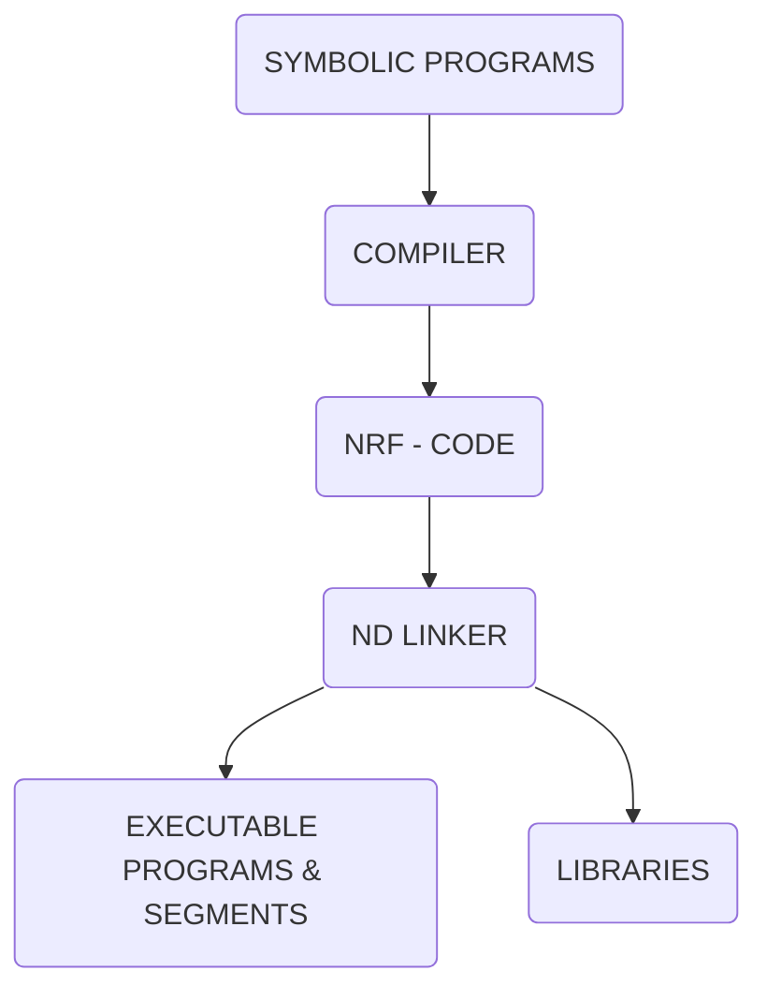
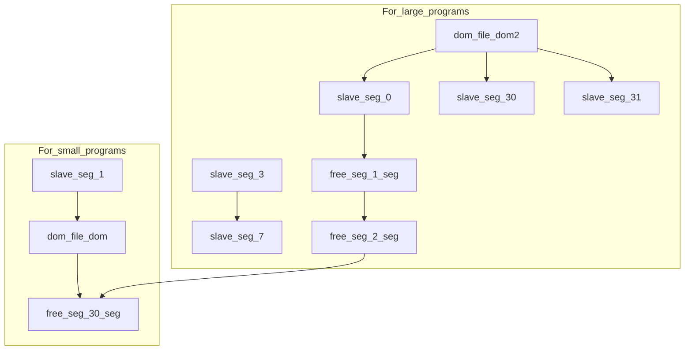

## Page 1

# ND LINKER

**ND 211224 ND LINKER for ND-500/ND-5000  
ND 211229 CONVERT-DOMAIN**



```
             ND
           Norsk Data
```

---

## Page 2

# ND LINKER

## Introduction

The ND LINKER (NDL) converts compiled ND-500/5000 programs from ND Relocatable Format (NRF) into executable form (DOMAIN) which it stores on a domain file and/or segment file(s).

To start a program on an ND-500/ND-5000 computer, a domain or segment file containing the main program must be invoked. The segment files are optional, and may be used for instructions and data common to one or more domains, e.g. libraries. By linking the domains to the segments, space can be saved and/or performance increased.

## Features

- Self-contained domain files
- Up to 32 program segments and 32 data segments per domain
- Each segment may be up to 128 Mb, giving a total address space of 4.2 Gb of program and 4.2 Gb of data
- Specified NRF modules may be loaded from NRF files
- Specified entries on segment files may be linked
- Easy to port domains to other users and machines
- Link lock/link key concept assures consistency between the domain file and the segment file(s) at runtime
- Standard actions on CLOSE (e.g. trap commands, load or link of standard libraries etc.) may be stored on file on the current user or on user SYSTEM
- Memory allocation facility to fix segments in memory at runtime
- Communication to ND-100 via RTCOMMON and ND-100 segments
- Powerful library handler to build, maintain and inspect NRF libraries
- Online help facility for command keywords and detailed command description
- History facility which enables the user to inspect, print and save input and output data
- Full ND-NOTIS editing on commands and parameters
- Job-control language facility

---

[Scanned by Jonny Oddene for Sintran Data © 2010]

---

## Page 3

# ND LINKER

## Product Description

An executable ND-500/5000 program is called a DOMAIN. It may consist of up to 32 subparts for data, and 32 subparts for program. These subparts are called SEGMENTS, and may for example be subroutines or shared data. Segments may be shared with other domains. A domain is identified by its name, which is the same as the file name.

Segments physically contained within a domain file are called SLAVE SEGMENTS. Slave segments have no name, just a number from 0 to 31.

Segments residing on segment files are called FREE SEGMENTS. Free segments have both a name (which is the same as the file name) and a number from 0 to 31. Free segments may be linked to domains or other free segments as long as the name and number do not coincide with those already defined.

A special type of slave segment is a FORTRAN common segment. This segment may remain open during the loading so that the FORTRAN common blocks loaded may be directed to and stored on the segment, while instructions and other data are directed to the current slave segment.

Each domain and free segment contains a file header. The header manages the rest of the domain and includes information as to the contents of the domain and its size. In addition to the header, the domain and segments contain debug/link information, the symbol table and the program and/or data segments.

Due to the large address space available for each segment, most users would find one program and data segment sufficient for running their programs. The following advantages may, however, be gained by splitting a system and loading it to several free segments:

- Free segments may be used to enable standard libraries to be accessed by several programs simultaneously. This reduces both memory and mass-storage requirements.
- Segments are reentrant and will thus reduce physical memory requirements.
- Segments may be protected; for example, a read-only data segment prevents important data from being destroyed by mistake.

The figure below shows some typical configurations:



## Convert Domain

A subsystem called CONVERT-DOMAIN (ND 211229) supports conversion from the format generated by the LINKAGE LOADER (ND 210319) to the current domain format.

It is possible to run both domain formats simultaneously.

## Documentation

| Document                            | Reference       |
|-------------------------------------|-----------------|
| ND Linker - User Guide and Reference Manual | ND-60.289 EN |

---

## Page 4

# Contact Information

## Corporate Headquarters

**Address:**
Ole Deviks vei 5  
P.O. Box 50, Bryn  
N-0611 Oslo 6  
Norway

**Contact:**
- Tel: +47-2-270000
- Telex: 79674 sens n  
  005285460 nd  
  26629 nd n  
- Telefax: +47-2-270925  
- Manufacturer's no: +47-2-275844

---

## Norway

**Address:**  
Ole Deviks vei 6  
P.O. Box 50, Bryn  
N-0611 Oslo 6  
Norway

**Contact:**
- Tel: +47-2-270000  
- Telex: 79674 sens n  
- Stavanger: +47-4-550000  
- Bergen: Tel: +47-5-329090  
- Trondheim: +47-7-513333  
- Tromsø: Tel: +47-83-86622

---

## ND Comptec

**Address:**  
Ole Deviks vei 5  
P.O. Box 50, Bryn  
N-0611 Oslo 6  
Norway

**Contact:**
- Tel: +47-2-620000  
- Telex: 79674 sens n  
- Sweden: +46-8-7517450  
- Denmark: Tel: +45-86-36544  
- West Germany: +49-911-65055  
- Austria: Tel: +43-1-309-7201  
- Netherlands: +31-36182-103  
- USA: +1-703-6618500

---

## ND International

**Address:**  
Ole Deviks vei 6  
P.O. Box 50, Bryn  
N-0611 Oslo 6  
Norway

**Contact:**
- Tel: +47-2-620000  
- Telex: 75870 n  
- Telefax: +47-2-620061

---

## Sweden

**Contact:**
- ND Norsk Data AB  
  Karolinska D11  
  P.O. Box 27141  
  S-102 52 Upplands Väsby  
  Tel: +46-8-7513600  
- Telebox: +46-8-7517450 
- Gothenburg: Tel: +46-31-486760  
- Malmö: Tel: +46-40-570510

---

## ND-Silvadata Sweden

**Address:**  
S91 84 Sundsvall  
Sweden

**Contact:**
- Tel: +46-60-151510  
- Telefax: +46-60-171850

---

## Denmark

**Contact:**
- ND Norsk Data A S  
  Lautrupbjerg 1-3  
  P.O. Box 221  
  DK-2750 Ballerup  
  Tel: +45-86-86546  
- Telefax: +45-86-180905

---

## Finland

**Contact:**
- Oy Norsk Data A/S  
  Porsonkierto  
  Box 57  
  SF-00381 Helsinki  
- Tel: +358-0-3486111  
- Telefax: +358-0-3682262

---

## United Kingdom

**Contact:**
- Norsk Data Ltd.  
  Benyon Valeo  
  Newbury, RG13 8LU  
  United Kingdom  
- Tel: +44-635-39211  
- Telefax: +44-635-85284 

---

## West Germany

**Contact:**
- Norsk Data GmbH  
  Thorstärnen 10-12  
  5800 Bad Hamburg v.d.H.  
- Tel: +49-6172-6400  
- Telefax: +49-6172-23 8004 

---

## Belgium

**Contact:**
- Wordplex Belgium S.A.  
- Tel: +32-3-270265  
- Telefax: +32-2-7109581

---

## France

**Contact:**
- Norsk Grande Paris  
- Tel: +33-1-40255000  
- Telefax: +33-1-40370000

---

## Ireland

**Contact:**
- Norsk Data Ireland Ltd. A/S  
  IDA Industrial Estate, Santry Avenue  
  Dublin 9  
  Ireland  
- Tel: +353-1-457204  
- Telefax: +353-1-421121

---

## Luxembourg

**Contact:**
- Wordplex Luxembourg  
- Tel: +352-998745  
- Telefax: +352-354801

---

## The Netherlands

**Contact:**
- Norsk Data Nederland B.V  
- P.O. Box 550  
- 3300 AN Nieuwegein  
- Tel: +31-3602-74211  
- Telefax: +31-3602-73419

---

## Spain

**Contact:**
- Norsk Data - Wordplex España S.A.  
  Paseo de Garcia 50  
  08007 Barcelona  
  Spain  
- Tel: +34-3394409 
- Telefax: +34-34197702

---

## Switzerland

**Contact:**
- Norsk Data (Switzerland) S.A.  
- Tel: +41-1-268320

---

## Australia

**Contact:**
- Wordplex Australia Pty. Ltd.  
- Tel: +61-7-8951333

---

## Hong Kong

**Contact:**
- Norsk Data International  
- Tel: +852-491921/491923

---

## USA

**Contact:**
- Norsk Data Inc.  
- Tel: +1-617-366-9362

---

## Agents and Distributors

### France
- Telefon: +33-1-40370000

### Iceland
- Telefon: +354-961360  

### India
- Telefon: +91-11-46871128

### Pakistan
- Telefon: +92-25-314595

### Thailand
- Telefon: +66-253-9684

---

```
      _   _   _______   _______    _____  
     | | | | |__   __| |__   __|  / ____| 
     | |_| |    | |       | |    | (___   
     |  _  |    | |       | |     \___ \  
     | | | |    | |       | |     ____) | 
     |_| |_|    |_|       |_|    |_____/  
```

---

**Note:** Contact information is subject to change without notice and does not represent a commitment on the part of Norsk Data.

---

