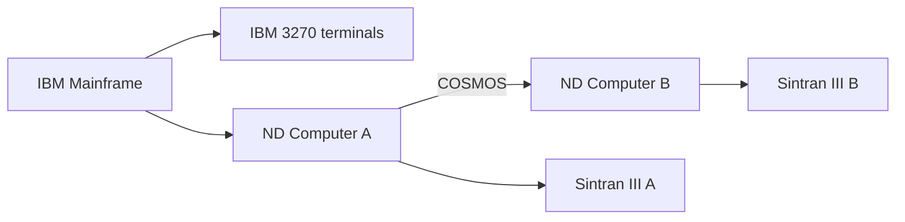
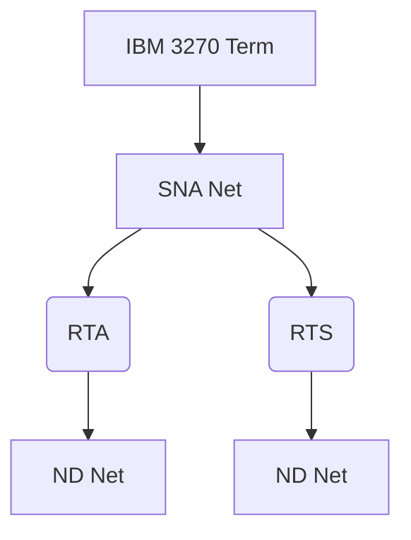

## Page 1

# ND SNA Remote Terminal Server and Access II

**ND 211283 SNA Remote Terminal Server II**  
**ND 211282 SNA Remote Terminal Access II**



[Logo: ND, Norsk Data]

---

## Page 2

# ND SNA Remote Terminal Server and Access II

## Introduction

SNA Remote Terminal Server II (SNA RTS) and SNA Remote Terminal Access II (SNA RTA) are ND software products which allow IBM 3270 terminals connected to an IBM® mainframe to log on to the ND COSMOS network via ND's SNA Gateway II.

With these two products, Norsk Data opens the possibility for IBM users to log on to the IBM and ND worlds from the same terminal. Up to now only ND terminal users had this possibility.

```mermaid
flowchart TB
    A[IBM Mainframe] --> B[ND 1122B]
    B --> C(SNA Remote Terminal Access II)
    C --> D[MVS or DOS / VSE]
    D --> E[VTAM]
    E --> F[IBM Frontend 37XX]
    F --> G[IBM 3270 Terminal]
    G -->|Local ND Computer A| I[SNA Gateway II]
    I --> J[ND 1122B]
    J --> K[SNA Remote Terminal Server II]
    I -->|Remote ND Computer B| L[ND 108670 PIOC]
    L --> M[ND-100 / 110 or ND-500 / 5000 Computers]
    M -->|COSMOS| N[User Environment (A) and SINTRAN III (A)]
    M --> O[User Environment (B) and SINTRAN III (B)]
```

**Figure 1. Overview of RTA and RTS in a COSMOS network.**

## Features

- Interactively use, operate and control an ND system from an IBM 3270 terminal.
- Full-screen support (VT100). This implies that most ND-NOTIS applications, except graphics like NOTIS-DRAW, can be used from the IBM 3270 terminal.
- The IBM terminal user can use all ND computers (where he has access) in a COSMOS network.
- Support for up to 64 simultaneous IBM 3270 terminal users per ND SNA Gateway II.
- Connection to more than one ND COSMOS network from the same IBM SNA network (RTA) simultaneously.
- Connection from more than one IBM SNA network to the same ND COSMOS network (RTS) simultaneously.



**Figure 2**


**Figure 3**

---

## Page 3

# ND SNA Remote Terminal Server and Access II

## Product Description

RTS is a part of the program structure in the ND NOTIS-DISOSS Bridge. The product runs in the ND-100 and uses SNA LU Type 0.

The main difference from the DISOSS is that the initiative or log-on is taken from the IBM side. This means that the LU is defined here for use in the SNA Gateway (PIOC) will be in 'Bind Expected' state, or, in other words, waiting for a log-on from the IBM.

When the log-on arrives from the SNA gateway, the RTS compares the input with the local ND computer name in COSMOS. If the name is correct, a TAD connect request will be formed and sent to the local TADADMINistrator. If the name is different from the local name, COSMOS will perform a request with the system name (CONNECT-TO) and get a remote TAD in the ND COSMOS network.

This means that all systems in the COSMOS network are available to the IBM 3270 terminal user provided that the ND systems are defined in the local ND COSMOS system.

RTA is a TP monitor running in an IBM mainframe, and interfaces directly with VTAM. RTA's main function is to serve as a bridge between an IBM 3270 terminal and an ND system.

In order to perform this task, RTA needs to maintain two SNA sessions for each IBM 3270 terminal user: one session between RTA and the IBM terminal (LU type 2), and another between RTA and RTS (LU type 0).

64 is the maximum number of simultaneous sessions possibly active between RTA and RTS over one SNA Gateway.

RTA is an IBM 370 assembly program, delivered on tape.

## Terminal Type and Scrolling

The data to and from the IBM 3270 terminal will be treated as a terminal type 6 (VT100) in the ND world. This means that the data sent to the terminal is screen oriented. VT100 is a worldwide standard for terminal handling and most ND applications support VT100 terminals. Program editors like PED and LED and most ND-NOTIS office applications can be run from an IBM 3270 terminal. The 24 IBM Program Function Keys (PF-Keys) are default-programmed with functions like MOVE, COPY and END and can be changed in accordance with the user's needs.

As the IBM 3270 terminals do not have the scrolling functionality of those used by the ND systems, this functionality has to be handled slightly differently. Normally, a scroll function rolls the top line off the screen and inserts the new line at the bottom. To emulate this function on an IBM 3270 terminal, RTA would have to edit the whole screen for every output, and this means considerable overhead of data between RTA and the IBM 3270 terminal. Instead of scrolling, the RTA uses paging. When the screen is full, the next line appears at the top of the screen, and the following line is erased to improve the visual aspect.

## Requirements

### IBM Environment

- ND 211282 SNA Remote Terminal Access II (one for each IBM SNA network)
- IBM mainframe 30XX, 43XX, 370, 9370
- VTAM
- IBM Frontend 37XX and NCP
- MVS or DOS/VSE Operating systems
- IBM 3270 terminal models 2, 3, 4 and 5 (IBM 3279, 3179, 3278, 3290, IBM 3270 PC)

### ND Environment

- ND 211283 SNA Remote Terminal Server II (one for each SNA Gateway II)
- ND-100, ND-110, ND-500 or ND-5000 computer
- SINTRAN III version X or later
- ND 211277 SNA Gateway II
- ND 108670 PIOC
- ND 210459 VTM tables for VT100

## Documentation

### Manuals:

SNA Remote Terminal Access II, Installation Guide  
ND 30.115 EN

User Guide  
ND 60.311 EN

SNA Gateway II, Supervisor Guide  
ND 30.113 EN

ND SNA Gateway II, Host Considerations  
ND 60.350 EN

## Abbreviations

| Abbreviation | Description |
|--------------|-------------|
| DOS/VSE      | Disk Operating System/Virtual System Extended |
| LED          | Language Editor |
| LU           | Logical Unit |
| MVS          | Multiple Virtual Storage |
| NCP          | Network Control Program |
| PED          | Program Editor |
| PIOC         | Programmable Input Output Controller |
| RTA          | Remote Terminal Access |
| RTS          | Remote Terminal Server |
| SNA          | Systems Network Architecture |
| TAD          | Terminal Access Device |
| VTAM         | Virtual Tele Access Method |

---

## Page 4

# Contact Information

| Country              | Phone Number          |
|----------------------|-----------------------|
| **Corporate Headquarters** | Tel: +47-2-626000     |
| Norway               | Tel: +47-2-626000     |
| Sweden               | Tel: +46-780-98400    |
| Denmark              | Tel: +45-2-86565      |
| Finland              | Tel: +358-0-328811    |
| United Kingdom       | Tel: +44-635-35644    |
| West Germany         | Tel: +49-6172-4080    |
| Belgium              | Tel: +32-2-7251560    |
| France               | Tel: +33-1-45371200   |
| Ireland              | tff: +353-1-42724     |
| Luxembourg           | Tel: +352-496167/8/9  |
| The Netherlands      | Tel: +31-3402-72411   |
| Spain                | Tel: +34-3-2152987 +  |
| Switzerland          | Tel: +41-21-250122    |
| Hong Kong            | Tel: +852-5-411912/412053 |
| USA                  | Tel: +1-617-368-4862  |
| Iceland              | Tel: +354-1-673711    |
| India                | Tel: +9144-419217/419126 |
| Pakistan             | Tel: +92-51-851446    |
| Thailand             | Tel: +66-2-253-9829/4 |
| ND Comtec Headquarters | Tel: +47-2-626000    |
| ND Comtec Austria    | Tel: +43-2266-5355    |
| ND Comtec USA        | Tel: +1-316-636-5000  |

---

Information in this document is subject to change without notice and does not represent a commitment on the part of Norsk Data.

---

Scanned by Jonny Oddene for Sintran Data © 2010

---

