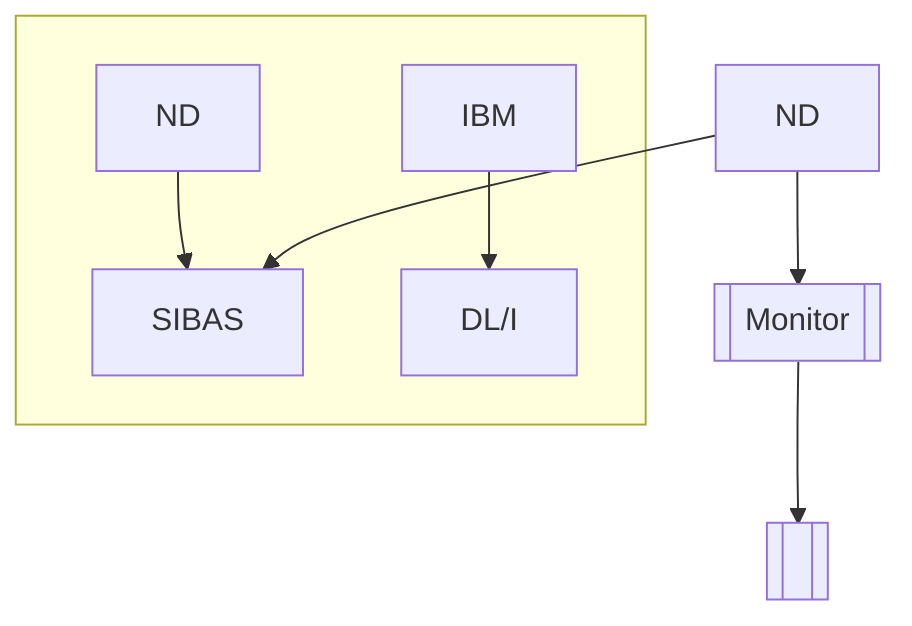
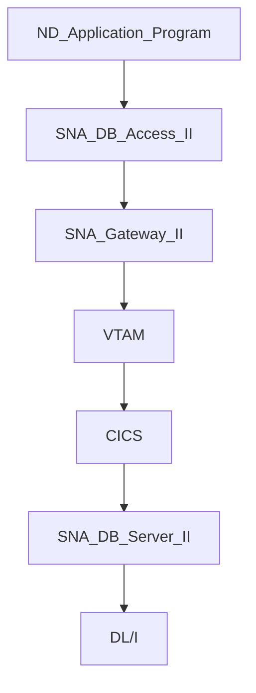

## Page 1

# ND SNA Database Access and Server II

ND 211284 SNA Database Access II  
ND 211285 SNA Database Server II



**Online Datalink**

---

```
   ____
  | ND |
  |____|

   ____
  |IBM |
  |____|

  SIBAS   DL/I

  ____
 | ND |
 |____|

  SIBAS

---------
| Monitor |
|_________|

  ---
 |   |
 |___|
```

**ND Norsk Data**

[Logo: ND Norsk Data]

---

Scanned by Jonny Oddene for Sintran Data © 2010

---

## Page 2

# ND SNA Database Access and Server II

## Introduction

The SNA Database Access and Server II let an ND application program retrieve data from a DL/I database on an IBM® mainframe. The server program is installed on the IBM machine and is called by the application through the access program over an SNA Gateway II connection.

## Features

- The server on the IBM side is application-independent and handles requests from any application connected to the gateway.
- The gateway and database connection is established by the access program with a single log-on call, referencing a scriptfile.
- A utility for establishing and maintaining the scriptfile is supplied.
- Data conversion may be specified.

## Product Description

The SNA Database Access II may be called as a subroutine from ND application programs written in COBOL, FORTRAN, or PLAN C. The call is conveyed to the SNA Database Server II, which is installed as a transaction program running under CICS®. The server makes the corresponding DL/I requests and returns the data to the access subroutine, which may perform data conversion as appropriate before the record is passed to the application.

The communication between the access and server programs requires the SNA Gateway.



## Subroutine Calls

The following subroutine calls may be made to the access program:

- **APPL** - log on, by means of a procedure stored in a scriptfile, to connect to CICS and start the server, to specify which databases will be accessed by means of a Program Specification Block (PSB).
- **CPSB** - Change Program Specification Block, to access other databases.
- **LOFF** - log off (scriptfile procedure).
- **QUAL** - select which database (i.e., Program Communication Block) to access (each Program Specification Block can consist of up to 12 databases), and specify data conversion.
- Record access (according to a Segment Search Argument), either:
  - **GU** - get unique record
  - **GN** - get next record
  - **GNP** - get next record within parent

The conversion is used when the record (segment in DL/I terms) contains fields in either packed decimal (BCD), integer, or real format.

## Requirements

- SNA Gateway II, ND 212177 must be installed.
- The access and server programs work in pairs, i.e., one or more access programs must be connected to one server program, and vice versa.

## Documentation

| Document                     | Code      |
|------------------------------|-----------|
| SNA Database Access II Programmer Guide | ND-60.270 EN |
| SNA Database Server II Installation Guide | ND-30.109.1 EN |

## Contact Information

| Location      | Phone            |
|---------------|------------------|
| Corporate Headquarters | Tel.: +47-2-628000 |
| Norway        | Tel.: +47-2-628000 |
| Sweden        | Tel.: +46-708-98400 |
| Denmark       | Tel.: +45-2-86655  |
| Finland       | Tel.: +358-0-368811 |
| United Kingdom| Tel.: +44-636-35544 |
| West Germany  | Tel.: +49-6172-6280 |
| Belgium       | Tel.: +32-2-7251650 |
| France        | Tel.: +33-1-45371200 |
| Ireland       | tlf.: +353-1-47224  |
| Luxembourg    | Tel.: +352-486716/8/9 |
| The Netherlands | Tel.: +31-3402-72411 |
| Spain         | Tel.: +34-3-215267 + |
| Switzerland   | Tel.: +41-21-250122  |
| Hong Kong     | Tel.: +852-5-411912/412063 |
| USA           | Tel.: +1-617-366-4862 |
| Iceland       | Tel.: +354-1-673711  |
| India         | Tel.: +9144-191271/491926 |
| Pakistan      | Tel.: +92-51-581446  |
| Thailand      | Tel.: +66-2-253-9832/4 |
| ND Comtec Headquarters | Tel.: +47-2-628000 |
| ND Comtec Austria | Tel.: +43-2265-5335 |
| ND Comtec USA  | Tel.: +1-316-636-5000 |

---

